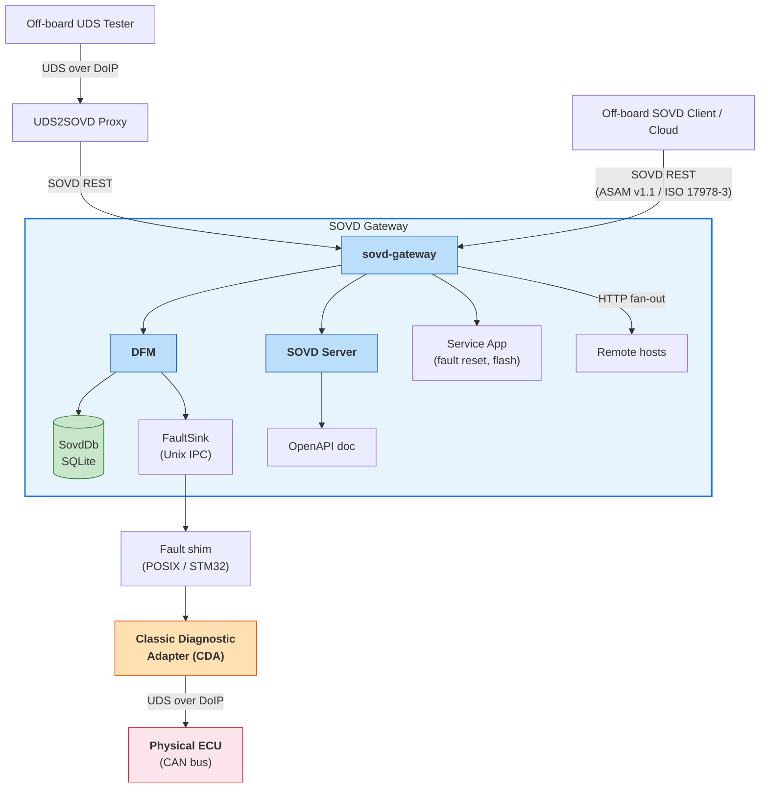
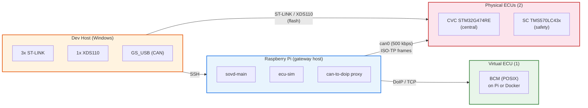

# taktflow-opensovd

Open-source **SOVD diagnostic stack** implementing the ASAM SOVD v1.1
OpenAPI (ISO 17978-3) -- from REST API to physical ECU, tested on real
automotive hardware.

Built by [Taktflow](https://github.com/Taktflow-Systems) as an OEM-owned
reference stack. Tracks [Eclipse OpenSOVD](https://github.com/eclipse-opensovd)
and [Eclipse S-CORE](https://projects.eclipse.org/projects/automotive.score)
as capability references and absorbs their designs downstream -- no upstream
code contribution (see MASTER-PLAN.md §1.3).

## Goal

Replace legacy UDS/CAN diagnostics with modern REST/HTTP for **multi-ECU
zonal architectures**. Every ECU -- regardless of role or zone -- becomes
reachable via standard HTTP tooling (`curl`, Postman, cloud fleet APIs)
instead of proprietary diagnostic hardware and binary protocols.

Taktflow's HIL bench uses a minimal 3-ECU zonal setup (CVC central + SC
safety + BCM virtual body) as the reference test integration (see ADR-0023).
The stack itself is architecture-agnostic within automotive diagnostics and
scales to arbitrary ECU counts without code change.

| Dimension | UDS (legacy) | SOVD (modern) |
|-----------|-------------|---------------|
| Transport | CAN + ISO-TP / DoIP | REST/HTTP over IP |
| Data format | Binary byte frames | JSON resources |
| Addressing | Session + service IDs | URL paths (`/sovd/v1/components/{id}/faults`) |
| Security | Seed/key | HTTPS + certificates + OAuth |
| Tooling | Specialized diagnostic tools | Any HTTP client |

## Scope

**In scope:**

- SOVD Server -- REST API implementing the ASAM SOVD v1.1 OpenAPI
  (ISO 17978-3), async Rust (Tokio + Axum)
- SOVD Gateway -- federated routing across local and remote diagnostic hosts
- Diagnostic Fault Manager (DFM) -- fault ingestion, persistence, operation-cycle gating
- Classic Diagnostic Adapter (CDA) -- SOVD-to-UDS/DoIP bridge for legacy ECUs
- Fault ingestion IPC -- Unix sockets / Windows named pipes, no_std-compatible wire format
- ODX-to-MDD converter -- diagnostic database format tooling
- Hardware-in-the-loop test bench -- 3 ECUs (CVC STM32G4 + SC TMS570 + BCM POSIX virtual), ADR-0023

**Out of scope:**

- Safety-relevant functionality (handled by S-CORE, ASIL-B). OpenSOVD is QM.
- Embedded RTOS or base software. Firmware lives in a separate repository.
- Production deployment tooling. This is the diagnostic stack, not the vehicle OS.

## Design principles

- **Rust-first.** Async (Tokio), memory-safe, `#![forbid(unsafe_code)]` where
  possible. Edition 2024, Rust 1.88+. Clippy pedantic + deny rules enforced in CI.
- **Trait boundaries, not frameworks.** `sovd-interfaces` defines all contracts
  (SovdBackend, FaultSink, SovdDb, OperationCycle) with zero I/O. Implementations
  are swappable: SQLite or S-CORE KV for persistence, Unix sockets or LoLa
  shared-memory for fault transport, Taktflow or S-CORE lifecycle for operation cycles.
- **Spec-locked API surface.** OpenAPI schema is snapshot-tested against ASAM
  SOVD v1.1 (ISO 17978-3).
  `cargo xtask openapi-dump --check` gates every PR.
- **Track upstream, absorb designs, stay downstream.** Vendored upstream
  subtrees are re-synced in verified passes; upstream design work is absorbed
  as named work items (PROD-15..17). Upstream code contribution was dropped
  2026-04-20 (MASTER-PLAN.md §10.4 D-01).

## Current status

**Part II -- Production Grade** (Part I complete April 2026)

Part I phases P0-P11 (milestones M1-M10: scaffolding through physical
3-ECU HIL, hardening, semantic/COVESA + extended vehicle, edge ML,
ISO 21434 case, pluggable backends, conformance suites) are complete --
see [MASTER-PLAN.md](MASTER-PLAN.md) §7/§13. Active work follows
[MASTER-PLAN-PART-2-PRODUCTION-GRADE.md](MASTER-PLAN-PART-2-PRODUCTION-GRADE.md):
UDS2SOVD ingress proxy (PROD-20) delivered, SOVD spec data filters
(PROD-12) and typed client version discovery (PROD-19) landed, HPC port
(PROD-1) and monthly upstream tracking (PROD-15) ongoing.

| Component | State |
|-----------|-------|
| SOVD Server (Axum, async) | Running on Raspberry Pi, REST API live |
| SOVD Gateway | Federated host routing, parallel fan-out, TOML config |
| Diagnostic Fault Manager | SQLite persistence, operation-cycle gating, 50ms lock budget |
| Fault ingestion IPC | Unix sockets + postcard wire format (no_std-compatible) |
| Classic Diagnostic Adapter | 68k LoC Rust, DoIP + UDS session management, MDD database |
| CAN-to-DoIP proxy | Bridging physical STM32 ECUs to SOVD stack |
| Embedded UDS (STM32) | CVC SingleFrame F191 round-trip proven live on real hardware |
| OpenAPI contract | Snapshot-locked to ASAM SOVD v1.1 OpenAPI (ISO 17978-3), xtask regeneration |

Phase-by-phase delivery history lives in MASTER-PLAN.md §13 (Phase
Completion Record and Achievements Log).

## Testing

Counts are the Part-I Phase-5 snapshot (April 2026); all gates still run
on every push.

| Layer | What | Count |
|-------|------|-------|
| Unit + async | `#[test]` + `#[tokio::test]` across all Rust crates | 5,680 |
| Snapshot | `insta` schema snapshots (sovd-interfaces, locked to ASAM SOVD v1.1 OpenAPI / ISO 17978-3) | 36 files |
| OpenAPI contract | Schema regeneration gate (`cargo xtask openapi-dump --check`) | per PR |
| Integration | End-to-end flows: in-memory MVP, CDA+ECU-sim, DFM SQLite roundtrip, gateway routing | 25 test files |
| HIL | Live CAN captures on physical STM32 bench (vcan0 smoke, real CAN, proxy) | 3 capture logs |
| CI enforcement | clippy pedantic + deny-warnings, rustfmt, cargo-deny (license + advisory audit) | every push |

CI runs on Linux and Windows, stable (1.88.0) and nightly toolchains, with a
feature matrix covering all-features, minimal, and mbedtls-only configurations.

## Architecture

## Testing bench

Hardware-in-the-loop bench with physical and virtual ECUs:

| Service | Host | Role |
|---------|------|------|
| sovd-main | Pi | SOVD REST API |
| ecu-sim | Pi | Virtual ECU simulator (POSIX build of BCM) |
| can-to-doip proxy | Pi | Bridges CAN ISO-TP to DoIP for physical ECUs |

**3-ECU bench (ADR-0023):**

- **CVC** — STM32G474RE, central vehicle controller, ST-LINK flashing
- **SC** — TMS570LC43x, safety controller, XDS110 flashing (different vendor,
  proves no accidental ST-lock-in)
- **BCM** — POSIX virtual, DoIP-direct path (no proxy)

The 3-ECU set covers every architectural code path in the stack. The stack
itself is not hardcoded to this count — additional ECUs can be added via
config without code change.

**Deployment:** `deploy/pi/phase5-full-stack.sh` cross-compiles for aarch64,
rsyncs to Pi, installs systemd units, and verifies with a health check.

## Repository map

### Core (~118k LoC Rust, ~14k LoC Kotlin)

| Directory | Language | Lines | Description |
|-----------|----------|-------|-------------|
| `opensovd-core/` | Rust | ~40k | SOVD Server, Gateway, DFM, Diagnostic DB, semantic/XV/ML adapters -- 23 workspace crates |
| `classic-diagnostic-adapter/` | Rust | ~75k | SOVD-to-UDS/DoIP bridge for legacy ECUs (vendored upstream subtree) |
| `fault-lib/` | Rust | ~600 | Framework-agnostic fault reporting API, `#![forbid(unsafe_code)]` |
| `dlt-tracing-lib/` | Rust | ~1.9k | Rust `tracing` subscriber for COVESA DLT daemon (FFI + safe wrapper) |
| `odx-converter/` | Kotlin | ~14k | ODX (.pdx) to MDD binary format converter with plugin API (vendored upstream subtree) |

### opensovd-core workspace detail

| Crate | Purpose |
|-------|---------|
| `sovd-interfaces` | Trait + type contracts: spec DTOs (snapshot-locked to ASAM SOVD v1.1), extras, Server/Gateway/Backend/Client/FaultSink traits. Zero I/O. |
| `sovd-server` | Axum HTTP server, routes to backend impls, OpenAPI generation via utoipa |
| `sovd-gateway` | Federated routing across local + remote SOVD hosts, parallel fan-out |
| `backend-adapter` | Host-scoped backend compatibility seam over the gateway (P10 pluggable backends) |
| `sovd-dfm` | Diagnostic Fault Manager -- pluggable persistence, fault sink, operation cycle (ADR-0016) |
| `sovd-db`, `sovd-db-sqlite`, `sovd-db-score` | Persistence: shared layer, SQLite (WAL, auto-migration) default, S-CORE key-value backend |
| `fault-sink-unix`, `fault-sink-lola`, `fault-sink-mqtt` | Fault ingestion transports: Unix socket/named pipe (postcard), S-CORE LoLa shared memory, MQTT ring-buffer publisher (ADR-0024) |
| `opcycle-taktflow`, `opcycle-score-lifecycle` | Operation-cycle state machines: in-process default, S-CORE lifecycle subscriber |
| `sovd-covesa` | COVESA VSS semantic adapter -- pinned VSS release + YAML mapping onto SOVD endpoints (ADR-0026) |
| `sovd-extended-vehicle` | ISO 20078-shaped Extended Vehicle REST/MQTT contracts (ADR-0027) |
| `sovd-ml` | Edge ML fault prediction -- signed ONNX model layout, verify-before-load (ADR-0028/0029) |
| `sovd-client-rust` | Typed Rust SDK for `/sovd/v1/*` incl. version discovery; `sovd-client` is its compatibility re-export shim |
| `sovd-tracing` | Shared tracing bootstrap: fmt/journal, COVESA DLT, OTLP export |
| `ws-bridge` | MQTT-to-WebSocket relay (ADR-0024 Stage 1) |
| `sovd-main` | Entry point binary, wires backends from TOML config |
| `xtask` | `cargo xtask openapi-dump [--check]` for OpenAPI YAML regeneration |
| `integration-tests` | End-to-end HIL and contract tests |

### Adjacent

| Directory | Language | Description |
|-----------|----------|-------------|
| `uds2sovd-proxy/` | Rust | UDS/DoIP-to-SOVD REST ingress proxy -- implemented (PROD-20, closed 2026-05) |
| `cpp-bindings/` | C++ | C++ API bindings -- vendored upstream stub (upstream has not started) |

### Reference (read-only)

| Directory | Description |
|-----------|-------------|
| `opensovd/` | Upstream architecture specs, ADRs, MVP roadmap, governance |
| `external/opendbc/` | Community DBC files for CAN signal decoding |
| `external/odxtools/` | Mercedes-Benz ODX data model (Python, MIT) |
| `external/asam-public/` | Freely available ASAM/ISO/AUTOSAR specs including ISO 17978-3 OpenAPI |
| `external/cicd-workflows/` | Eclipse OpenSOVD shared GitHub Actions |

### Documentation

| Path | Description |
|------|-------------|
| `docs/SYSTEM-SPECIFICATION.md` | **Single-file consolidated spec: architecture + requirements + safety + API + state machines** |
| `docs/ARCHITECTURE.md` | arc42-format system design and deployment topology |
| `docs/REQUIREMENTS.md` | FR/NFR/SR/SEC/COMP requirements, ASPICE-traceable |
| `docs/TRADE-STUDIES.md` | 18 trade studies: every major technical decision with options, criteria, rationale |
| `docs/SAFETY-CONCEPT.md` | Safety classification, QM/ASIL boundary, Fault Library isolation |
| `docs/TEST-STRATEGY.md` | Test levels, CI pipeline, HIL gating, coverage tooling |
| `docs/CODING-STANDARDS.md` | Rust/Kotlin formatting, linting, error handling, naming, SPDX |
| `docs/DEVELOPER-GUIDE.md` | Build prerequisites, toolchain setup, run and test instructions |
| `docs/DEPLOYMENT-GUIDE.md` | SIL / HIL / production topology, configuration, rollback |
| `docs/GLOSSARY.md` | Domain terms: SOVD, UDS, DTC, DoIP, ASIL, DFM, and more |
| `docs/adr/` | Architecture Decision Records ADR-0001..ADR-0040 (ADR-0007 archived 2026-04-20) |
| `.github/CONTRIBUTING.md` | How to contribute, PR process, commit conventions |
| `.github/CODE_OF_CONDUCT.md` | Eclipse Community Code of Conduct |
| `.github/CHANGELOG.md` | Release history by phase |
| `ENGINEERING-SPECIFICATION.html` | Single-file browser engineering spec with system definition and development story |

## Relationship to upstream

Taktflow implementation of the Eclipse OpenSOVD architecture, developed
downstream. `opensovd-core/` (SOVD Server, Gateway, DFM, Diagnostic DB) is
Taktflow-authored; upstream
[eclipse-opensovd/opensovd-core](https://github.com/eclipse-opensovd/opensovd-core)
gained its own reference implementation on 2026-04-28 (Liebherr
contribution) and is tracked as a pattern source, not vendored (Q-PROD-11).
`classic-diagnostic-adapter/`, `odx-converter/`, `fault-lib/`,
`dlt-tracing-lib/`, `cpp-bindings/`, `uds2sovd-proxy/` (scaffold), and
`opensovd/` (specs/governance) are vendored upstream subtrees, re-synced in
verified absorption passes. Drift is reviewed monthly under PROD-15 --
reports live in [docs/upstream/](docs/upstream/). Upstream code
contribution was dropped 2026-04-20 (MASTER-PLAN.md §1.3; ADR-0007
archived).

OpenSOVD is the designated diagnostic layer for
[Eclipse S-CORE](https://projects.eclipse.org/projects/automotive.score);
the upstream S-CORE integration workstream (opensovd#108, DR-008-Int) is
tracked downstream under PROD-17 and Part I §5.4.4.

## License

Apache-2.0. See individual component LICENSE files.
