<!--
SPDX-FileCopyrightText: 2026 The Contributors to Eclipse OpenSOVD (Taktflow fork)
SPDX-License-Identifier: Apache-2.0
-->

# Taktflow Eclipse OpenSOVD — Architecture (arc42)

- Document ID: TAKTFLOW-SOVD-ARCH
- Revision: 1.0
- Status: Draft
- Date: 2026-04-14
- Owner: Taktflow SOVD workstream (architect)
- Template: arc42 v8 (section numbering per arc42)

Cross-references used throughout:
- MP = `H:\taktflow-opensovd\MASTER-PLAN.md`
- REQ = `H:\taktflow-opensovd\docs\REQUIREMENTS.md`
- UD = `H:\taktflow-opensovd\opensovd\docs\design\design.md` (upstream design)
- UMVP = `H:\taktflow-opensovd\opensovd\docs\design\mvp.md` (upstream MVP)
- ADR-SCORE = `H:\taktflow-opensovd\opensovd\docs\design\adr\001-adr-score-interface.md`
- CORE-ARCH = `H:\taktflow-opensovd\opensovd-core\ARCHITECTURE.md`

---

## 1. Introduction and Goals

### 1.1 Requirements overview

This document is the arc42 architecture description of the Taktflow Eclipse
OpenSOVD integration project. It realizes the requirements in REQ. Every
architectural element in this document traces back to one or more requirements
(FR/NFR/SR/SEC/COMP IDs) and to a principle in MP §A, §B, or §C.

The top three things the system must do:

1. Serve ASAM SOVD v1.1 OpenAPI (ISO 17978-3) REST endpoints for every
   Taktflow ECU (virtual and physical) with DTC read, clear,
   routine start/stop/status, and component metadata — REQ FR-1.x,
   FR-2.x, FR-3.x, FR-5.x.
2. Ingest faults from application and platform code on any ECU through a
   framework-agnostic Fault Library shim and surface them through the SOVD
   API — REQ FR-4.x.
3. Do both of the above without compromising the existing ISO 26262 ASIL-D
   safety lifecycle of Taktflow firmware — REQ SR-1.x, SR-4.x, SR-5.x;
   MP §C.4.

### 1.2 Quality goals

| Priority | Quality goal | Driving requirements |
|----------|--------------|----------------------|
| 1 | Safety preservation — no ASIL regression | SR-1.1, SR-1.2, SR-2.1, SR-4.1, SR-4.2, SR-5.1 |
| 2 | Max-sync with upstream Eclipse OpenSOVD code | NFR-6.1, NFR-6.2, NFR-6.3; MP §C.2 |
| 3 | Observable end-to-end (trace, logs, audit) | NFR-3.1, NFR-3.2, NFR-3.3, SEC-3.1 |
| 4 | Portable across SIL / HIL / prod without rebuild | NFR-4.1, NFR-4.2 |
| 5 | Latency within target bounds for the exposed SOVD API | NFR-1.1, NFR-1.2, NFR-1.3 |
| 6 | Security by default (TLS, authn, authz, rate) | SEC-1.1, SEC-2.x, SEC-5.1 |

### 1.3 Stakeholders

See REQ §2. The same stakeholder set applies here. Specifically, the
architecture must remain coherent for S2 (upstream OpenSOVD maintainers) and
S3 (S-CORE integration) because max-sync (NFR-6.1) and the Fault Library
boundary (ADR-SCORE) are non-negotiable.

### 1.4 Conformance scope

This project is explicit about the SOVD scope it can verify today.

- **What we verify:** the ASAM SOVD v1.1 OpenAPI wire contract published for
  ISO 17978-3, locked by `sovd-interfaces` schema snapshots and
  `cargo xtask openapi-dump --check`.
- **What we align with:** public scope statements and design descriptions for
  ISO 17978 Parts 1 and 2 from ASAM/ISO public pages, AUTOSAR `EXP_SOVD`,
  the Eclipse OpenSOVD `design.md` and `mvp.md`, the public Eclipse OpenSOVD
  CDA code when behavior is ambiguous, and the research notes in
  `external/asam-public/iso-17978-research/`.
- **What we do not claim:** full normative conformance to ISO 17978 Parts 1
  and 2, or any paywalled Part 3 prose that the team has not acquired yet
  (for example conformance classes, complete lock/session state diagrams, or
  normative error-taxonomy text).

Accordingly, this architecture claims implementation of the ASAM SOVD v1.1
OpenAPI MVP subset (ISO 17978-3), not blanket ISO 17978 conformance.

---

## 2. Architecture Constraints

### 2.1 Technical constraints

| # | Constraint | Source |
|---|------------|--------|
| TC-1 | Rust 1.88.0 stable (+ nightly rustfmt) | `rust-toolchain.toml`; NFR-6.2 |
| TC-2 | Rust edition 2024 | CORE-ARCH §Conventions; NFR-6.2 |
| TC-3 | `axum 0.8`, `tokio 1.x`, `sqlx` for SQLite, `async-trait` where needed for dyn traits | CORE-ARCH §Dependency direction; NFR-6.3 |
| TC-4 | `clippy --pedantic -D warnings` is a hard CI gate | NFR-6.4; MP §C.5 |
| TC-5 | Upstream sync window: max 7 days drift from upstream `main` | MP §C.2c |
| TC-6 | Embedded side is C11 / MISRA C:2012; no Rust on the ASIL-D firmware | MP §2.1 decision 3; NFR-6.5 |
| TC-7 | SQLite with WAL mode for DFM persistence | MP §2.1 decision 4; MP Risk R8 |
| TC-8 | Transport wire protocols fixed: HTTPS (SOVD), DoIP (TCP/13400), ISO-TP over CAN @ 500 kbps, Unix socket (IPC) | REQ FR-5.1, FR-5.2, FR-4.1, FR-4.2 |
| TC-9 | SPDX + Apache 2.0 on every source file; REUSE tooling passes | COMP-5.1 |

### 2.2 Organizational constraints

| # | Constraint | Source |
|---|------------|--------|
| OC-1 | Team size: 20 Taktflow-wide; SOVD workstream peak ~14 | MP §10 |
| OC-2 | Shadow-ninja mode: no upstream PRs in Phases 0-3 | MP §C.1; MP §8 |
| OC-3 | Upstream contribution decision in Phase 6 only; decision, not calendar | MP §8.1 |
| OC-4 | Phase gate reviews by architect + safety + Rust lead at every phase | MP §13.2 |
| OC-5 | Eclipse Contributor Agreement signed by every contributor | COMP-5.2; MP §15 item 9 |
| OC-6 | Weekly upstream sync ritual (Mon 09:00) and upstream-sync.yml | MP §C.2c; §7.3 |

### 2.3 Conventions

| # | Convention | Source |
|---|------------|--------|
| CV-1 | Commit prefixes: `mirror(...)`, `feat(...)`, `sync(upstream)`, `extras(...)` | MP §C.2b |
| CV-2 | Mermaid diagrams for architecture views; rendered natively on GitHub | Taktflow doc style |
| CV-3 | Type names and trait names follow `sovd-interfaces` verbatim | CORE-ARCH |
| CV-4 | All fallible operations return `Result<T, SovdError>` | CORE-ARCH §Conventions |

---

## 3. Context and Scope

### 3.1 Business context

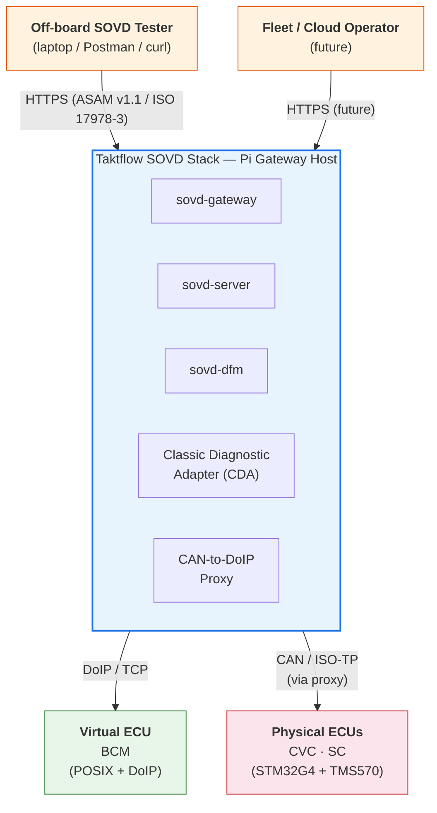

Actors:

- **Off-board SOVD tester** — the primary S1/S9 actor. Uses `curl` or a
  purpose-built client. Addresses the Pi gateway over HTTPS.
- **On-board apps / platform code** — invoke the Fault API on their ECU
  (FR-4.1). Do not care whether DFM is reachable (SR-4.1).
- **S-CORE (future)** — consumes the Fault Library shared with OpenSOVD per
  ADR-SCORE. Not directly integrated in MVP, but the Fault Library surface
  must not break this future boundary.
- **Taktflow firmware** — existing AUTOSAR-like BSW. Dcm and Dem are the main
  touchpoints (see notes-dcm-walkthrough.md, notes-dem-walkthrough.md).

### 3.2 Technical context

Protocols and wire formats, all rooted in REQ and master plan decisions:

| Hop | Protocol | Notes |
|-----|----------|-------|
| Tester -> Gateway/Server | HTTPS (ASAM SOVD v1.1 OpenAPI / ISO 17978-3) | TLS (SEC-1.1), mTLS (SEC-2.1), JSON bodies, correlation id header |
| Gateway -> Server | in-process fn / async channel | same host, single Tokio runtime |
| Gateway -> DFM | in-process fn via `SovdBackend` | `sovd-interfaces` trait |
| Gateway -> CDA | HTTP (CDA is an axum service) | in-proc or over loopback depending on topology |
| CDA -> ECU (virtual) | DoIP over TCP/13400 | Phase 1 POSIX transport |
| CDA -> Pi CAN proxy | DoIP over TCP/13400 | Pi listens, translates |
| Pi proxy -> physical ECU | ISO-TP over CAN 500 kbps | SocketCAN (`vcan0` in SIL) |
| Fault shim -> DFM (POSIX) | Unix domain socket | OQ-1 resolves transport |
| Fault shim -> DFM (STM32) | buffered in NvM, flushed by gateway sync | SR-4.1, SR-4.2 |
| DFM -> SQLite | sqlx via async driver | WAL mode, migrations |
| SOVD -> DLT | `dlt-tracing-lib` | NFR-3.1 |
| SOVD -> OTLP | OpenTelemetry exporter | NFR-3.2 |

---

## 4. Solution Strategy

The project-level strategy is fixed by MP §C and condensed here.

1. **Build first, contribute later (MP §C.1).** We build the entire
   opensovd-core stack in our private fork through Phases 0-5. Upstreaming is
   a Phase 6 decision, not a schedule item.
2. **Max-sync with upstream (MP §C.2a).** The `sovd-interfaces` crate already
   documents that the upstream design.md is the source of all role
   definitions (CORE-ARCH §Role definitions). Every new crate we introduce is
   written in a style indistinguishable from upstream CDA.
3. **Extras on top, never inside mirrored code (MP §C.2b).** When we need a
   Taktflow-specific behavior (e.g. routine preconditions for motor/brake
   tests), we add it as a layered crate or module, not as an inline edit to
   upstream-owned files.
4. **Concrete before abstract (MP §C.3).** The first SOVD Server realization
   targets one CVC virtual ECU in Docker. Only after UC1 is green end-to-end
   do we fan out to 3 ECUs (ADR-0023).
5. **Fork, track upstream, build extras on top (MP §C.2c).** `upstream-sync`
   cron rebases our `opensovd-core` fork weekly. Conflicts are resolved
   inside 24 h.
6. **Isolation over integration on the safety axis (SR-*).** The Fault
   Library boundary is the ONLY entry point from ASIL-D code into SOVD (per
   ADR-SCORE). SOVD never calls back into ASIL-D code; it can only receive
   non-blocking fault notifications.
7. **TDD-style punchlist driven by upstream CI (MP §C.2a).** We copy upstream
   build.yml and feature flags verbatim; failing CI is the punchlist.

---

## 5. Building Block View

### 5.1 Level 1 — Whole system

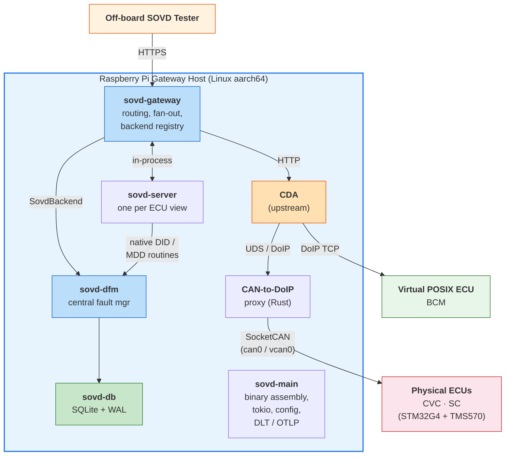

Legend: arrows show primary call direction. Fault API (FR-4.1) flow is
additive and not drawn here — see §6 runtime view UC2.

### 5.2 Level 2 — opensovd-core workspace

From CORE-ARCH §Dependency direction (re-stated here because the formal doc
must stand alone):

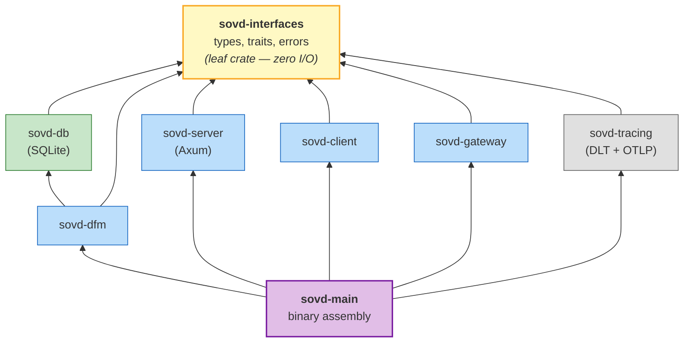

Crate responsibilities (verbatim from CORE-ARCH, abridged):

- **sovd-interfaces** — types, traits, errors. No runtime code. REQ FR-1..7
  types (`Dtc`, `ComponentId`, `RoutineId`, `DataIdentifier`, `Session`,
  `FaultRecord`, `SovdError`) and trait contracts (`SovdServer`,
  `SovdGateway`, `SovdBackend`, `SovdClient`, `FaultSink`).
- **sovd-db** — SQLite persistence via sqlx. Used only by sovd-dfm. Realizes
  FR-4.4.
- **sovd-dfm** — central fault aggregator, per-system, single instance.
  Implements `SovdBackend`. Realizes FR-4.x and FR-1.x (Fault-lib-backed
  path).
- **sovd-server** — per-ECU REST surface, realizes FR-1.x (server side),
  FR-2.x, FR-3.x, FR-7.x. One instance per ECU view.
- **sovd-gateway** — system-wide multiplexer. Realizes FR-1.5, FR-6.x.
- **sovd-client** — outbound caller. Used by testers and by sovd-gateway for
  federated hops. Realizes the client side of FR-6.2.
- **sovd-tracing** — common tracing + DLT + OTLP glue. Realizes NFR-3.x.
- **sovd-main** — binary assembly point. Loads config, wires Gateway ->
  Server -> DFM -> CDA adapter -> sovd-client federated adapters, boots Tokio.

### 5.3 Level 3 — Key internals

#### 5.3.1 sovd-dfm ingest path

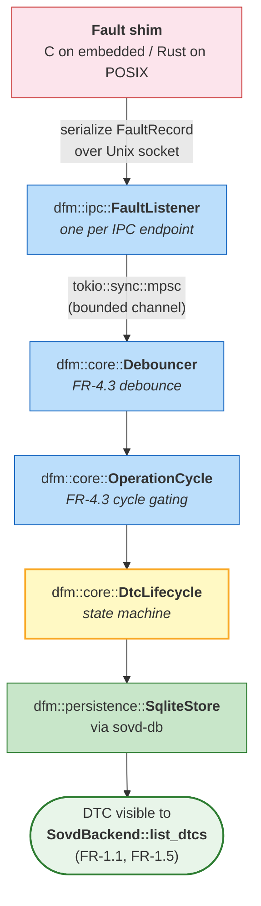

Ownership: `FaultListener` implements `FaultSink`. Debouncer, operation
cycle, and DTC lifecycle are internal DFM modules. The `SovdBackend` impl on
the DFM exposes the final DTC list to the gateway.

#### 5.3.2 sovd-gateway routing

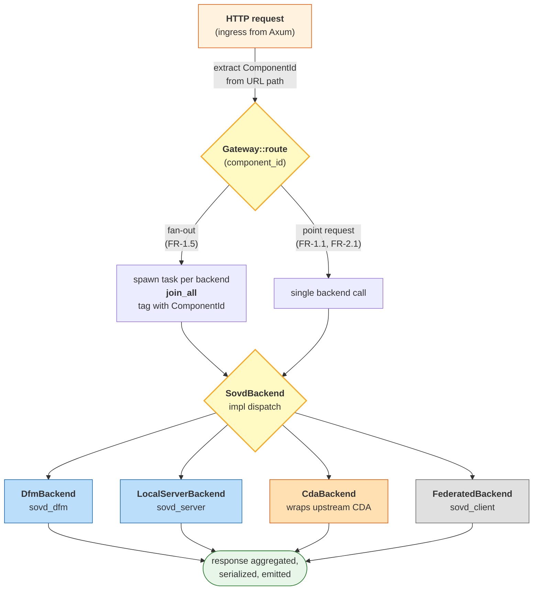

Backend registration is synchronous (`SovdGateway::register_backend`,
CORE-ARCH); duplicates are rejected (REQ FR-6.1).

#### 5.3.3 sovd-server request pipeline

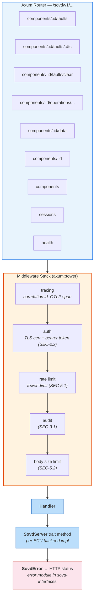

### 5.4 State machines

Two state machines govern the DFM fault pipeline. Both are internal to
`sovd-dfm` and not exposed via the REST API surface.

#### 5.4.1 DTC lifecycle

Every DTC transitions through these states after ingestion via the Fault
Library. The lifecycle is the core of the DFM's fault classification logic
(FR-4.3).

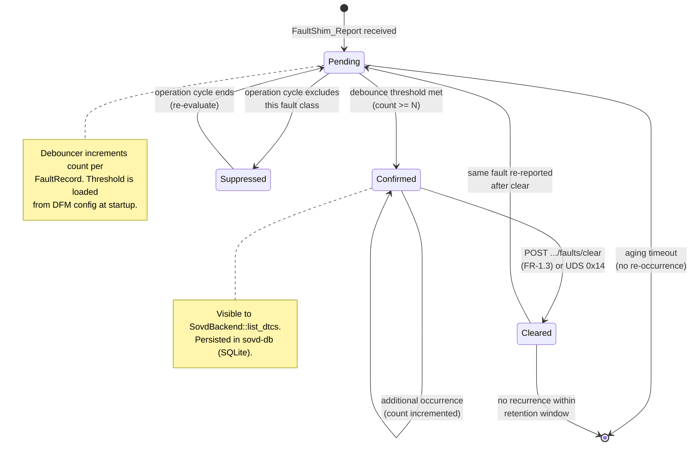

**State descriptions:**

| State | Visibility | Persisted | Description |
|-------|-----------|-----------|-------------|
| Pending | Not visible via SOVD | In-memory only | Fault observed but debounce threshold not yet met |
| Confirmed | Visible via GET .../faults | Yes (SQLite) | Threshold met; DTC is active and reported |
| Suppressed | Not visible | In-memory | Fault excluded by current operation cycle |
| Cleared | Not visible (reset) | Tombstone row | Cleared by tester or UDS command |

#### 5.4.2 Operation cycle

Operation cycles gate which faults are promoted from Pending to Confirmed.
The cycle API supports both tester-driven (REST) and ECU-driven (Fault Shim
IPC) triggering per ADR-0012.

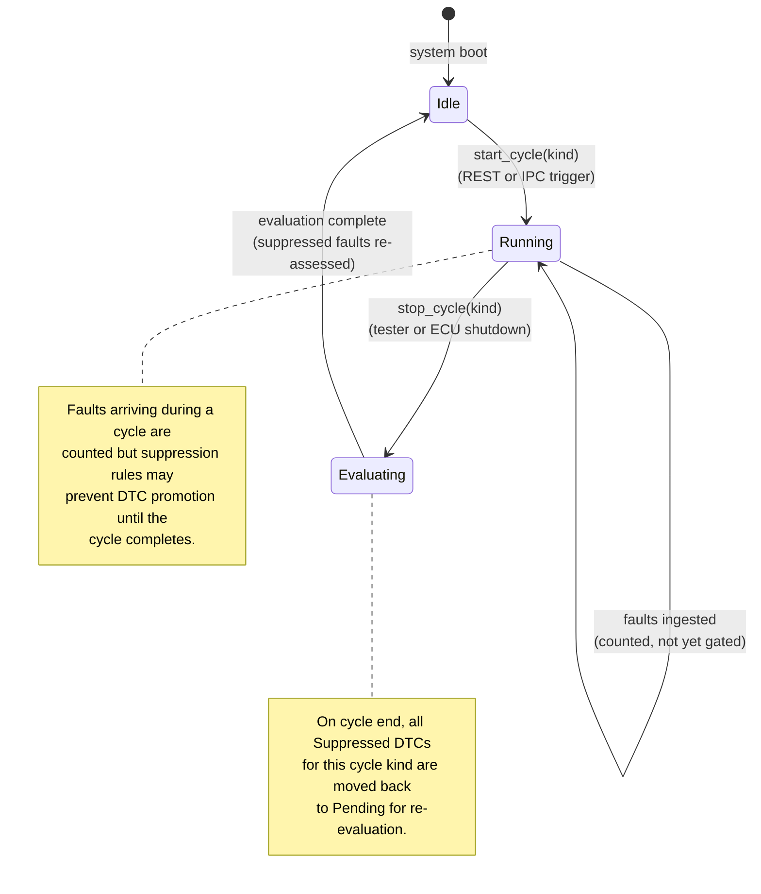

**Cycle kinds (MVP):**

| Kind | Trigger | Description |
|------|---------|-------------|
| Ignition | ECU power-on / power-off events via Fault Shim IPC | Standard automotive power cycle |
| Driving | Vehicle speed > 0 threshold via platform DID | Active driving cycle for motion-dependent faults |
| Tester | REST `POST .../operation-cycles/start` | Manual test cycle for diagnostics sessions |

---

## 6. Runtime View

All five MVP use cases expressed as sequence descriptions. References to REQ
and upstream docs inline.

### 6.1 UC1 — Read DTCs via SOVD (REQ FR-1.1, FR-1.5; UD §SOVD Server)

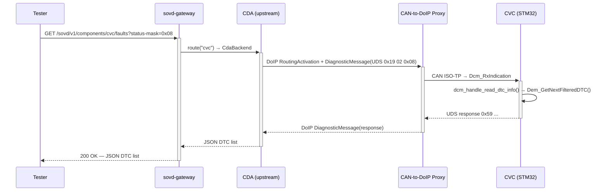

Safety notes: the request never touches any ASIL-D task other than the Dcm
input path that already exists today for 0x22. The new 0x19 handler is
stateless and self-contained (MP §3.1 effort row).

Variant for a DFM-backed component: `gateway -> sovd-dfm::list_dtcs` instead,
which reads from SQLite via sovd-db.

### 6.2 UC2 — Report fault via Fault API (REQ FR-4.1, FR-4.2, FR-4.3; UD §Fault Library)

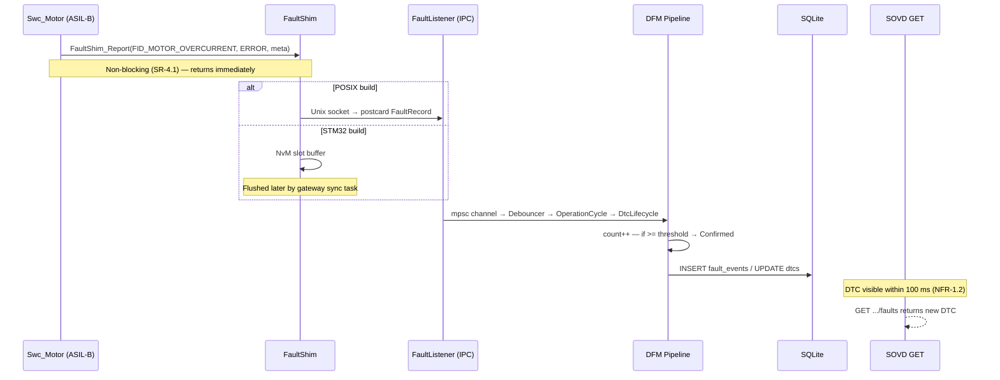

Failure-mode scenarios (SR-4.2):

- DFM process crashed: POSIX shim EPIPE, shim logs and returns without
  raising anything into safety path. STM32 shim buffers to NvM. Neither
  affects the calling SWC's deadline.
- IPC peer absent at boot: shim queues in a small ring and retries with
  backoff.

### 6.3 UC3 — Clear DTCs (REQ FR-1.3; UMVP §Use-cases 3)

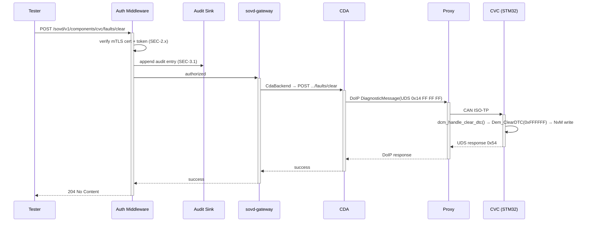

Safety notes: SR-3.x interlocks apply on clear for safety-critical DTC groups
if the ECU requires it; the server rejects unauthorized callers (SEC-2.2)
before any UDS traffic is emitted (SR-3.1 principle: fail closed).

### 6.4 UC4 — Reach a UDS ECU via CDA (REQ FR-5.1, FR-5.2)

Two sub-variants share this use case:

**UC4a — Virtual ECU (CVC POSIX build):**

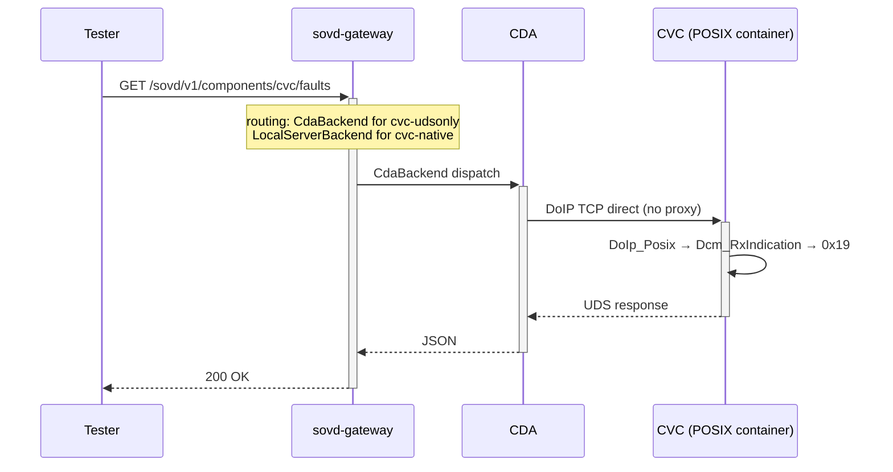

**UC4b — Physical ECU (CVC STM32):**

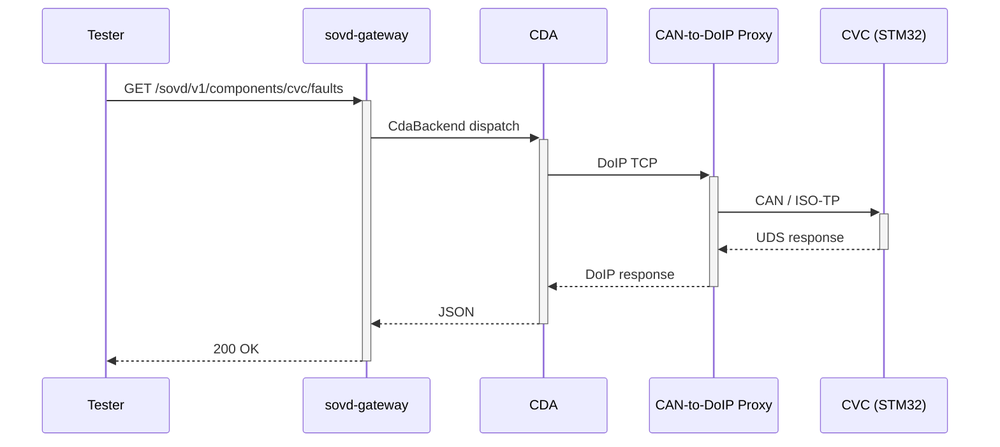

Both routes go through the same Gateway API; the backend kind
(`BackendKind::Cda` in both cases) is the same; only the transport under
CDA differs. This is deliberate: one surface, two topologies (NFR-4.1).

### 6.5 UC5 — Trigger diagnostic routine (REQ FR-2.1, FR-2.3)

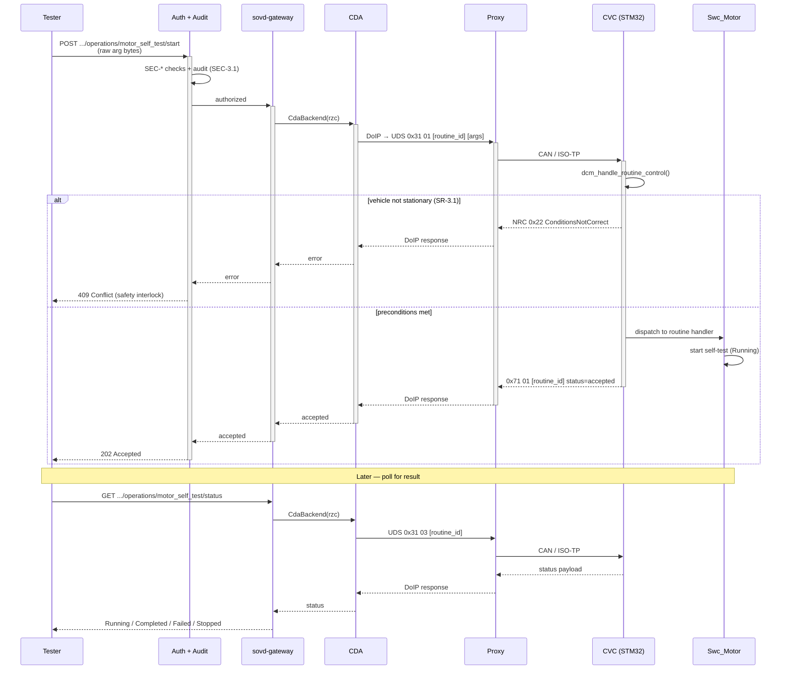

Concurrency note: the routine handler is async on the server side but the
underlying Dcm is single-threaded; ordering is preserved via the Dcm request
queue.

---

## 7. Deployment View

### 7.1 SIL topology (Docker Compose)

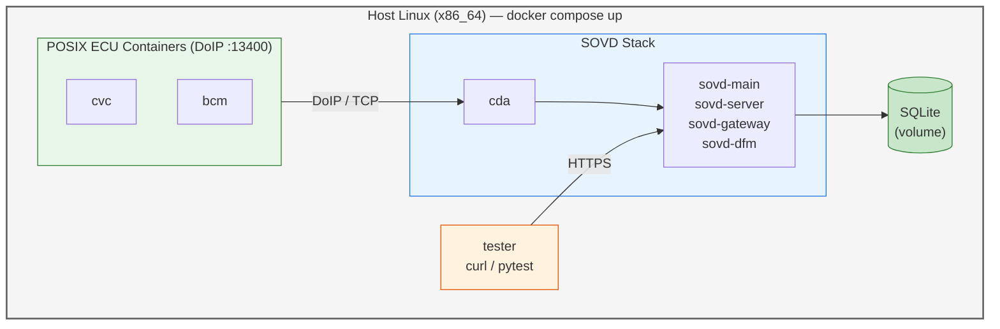

Constraints (NFR-4.1):
- Same binaries as HIL / prod; config toggles transport per-ECU.
- Host networking for DoIP; port 13400 reserved per container via explicit
  port map.

### 7.2 HIL topology (Pi bench + physical ECUs)

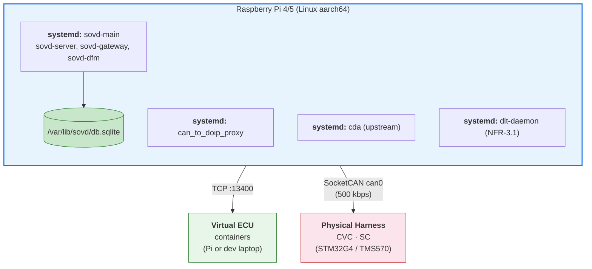

Constraints:
- CAN bus @ 500 kbps (Taktflow existing).
- SC (TMS570) reached via same proxy path; no physical DoIP on SC (MP §14
  deferred).
- HIL bench runs nightly via `sovd-hil-nightly.yml`.

### 7.3 Production topology

Same as HIL with differences:
- mTLS enforced (SEC-1.1, SEC-2.1), certs provisioned by script or HSM.
- Rate limits enabled (SEC-5.1).
- DLT feed to a cloud collector rather than local dlt-viewer.

---

## 8. Cross-cutting Concepts

### 8.1 Concurrency

- **Runtime**: one `tokio` multi-thread runtime per binary (`sovd-main`).
- **Async traits**: `SovdServer`, `SovdGateway`, `SovdClient` use stable
  `async fn in trait` because they are consumed generically.
  `SovdBackend` and `FaultSink` use `async-trait` because they are stored
  behind `dyn` in registries (CORE-ARCH §`SovdBackend`; §`FaultSink`).
- **Fan-out**: `sovd-gateway::list_all_dtcs` dispatches backends with
  `futures::future::join_all`; a single backend failure is logged and
  omitted, not fatal (FR-1.5).
- **Bounded channels everywhere**: DFM ingest uses a bounded mpsc; overflow
  behavior is drop-oldest with a metric.

### 8.2 Error handling

- Single `SovdError` enum in `sovd-interfaces`; every fallible op returns
  `Result<T, SovdError>`.
- HTTP mapping lives in `sovd-server::error` (not in `sovd-interfaces`).
- No `unwrap` or `expect` in production code paths; clippy pedantic enforces.
- Panic-on-poison in tests only; production handlers catch and convert.

### 8.3 Persistence

- `sovd-db` owns the SQLite schema and migrations (FR-4.4).
- Schema (MVP):
  - `dtcs(code PRIMARY KEY, component_id, status, severity, first_seen, last_seen, count)`
  - `fault_events(id PRIMARY KEY, code, timestamp, metadata)`
  - `operation_cycles(id PRIMARY KEY, kind, start, end)`
  - `catalog_version(id PRIMARY KEY, version, loaded_at)` (FR-4.5)
- WAL mode enabled (TC-7) for concurrent reads under write load.
- Migrations versioned; mismatch on startup is fatal (FR-4.4 acceptance 3).

### 8.4 Observability

- **DLT** via `sovd-tracing` wired to `dlt-tracing-lib` (NFR-3.1); context
  ids: `SOVD`, `GW`, `DFM`, `CDA`.
- **OTLP traces** covering ingress -> gateway -> server -> backend
  (NFR-3.2).
- **Structured JSON logs** with correlation ids from `X-Request-Id`
  (NFR-3.3).
- **Audit log** is a separate sink, append-only, carrying only privileged
  ops (SEC-3.1).

### 8.5 Security model

- **Transport**: HTTPS (SEC-1.1) with `rustls`. mTLS in prod (SEC-2.1).
- **AuthN**: TLS client cert + bearer token (SEC-2.1, SEC-2.2).
- **AuthZ**: fine-grained permission set mapped from token; enforced per
  route in `sovd-server::auth`.
- **Session**: `sessions` resource (FR-7.1); per-client, 30 s default
  timeout (SEC-4.1).
- **Rate limit**: per-IP via `tower::limit` (SEC-5.1).
- **Input validation**: body size and schema (SEC-5.2).
- **Secrets**: server cert/key loaded from files; prod uses HSM (deferred).

### 8.6 Safety boundary (critical)

The Fault Library is the only API through which safety-relevant code enters
the SOVD world (ADR-SCORE; REQ SR-4.1). Direction is always **shim -> SOVD,
never SOVD -> shim**. There is no mechanism by which a SOVD request can block
a safety function or modify ASIL-rated state. The embedded shim:

- Is C on embedded (MP §2.1 decision 3).
- Is non-blocking (SR-4.1).
- Buffers locally on STM32 (SR-4.2).
- Has FFI-stable signatures so S-CORE can consume them too (UD §Security Impact).

Any future extension that would let SOVD call back into safety-relevant code
must go through a new ADR and a HARA delta (SR-1.1).

### 8.7 Max-sync with upstream (how)

- The `opensovd-core` fork mirrors every upstream file in CDA: `build.yml`,
  `clippy.toml`, `rustfmt.toml`, `deny.toml`, `rust-toolchain.toml`,
  `Cargo.toml` workspace dependencies, feature flags, workflows. Diffs are
  minimal (`git diff upstream/main -- <mirrored>` must be near-zero).
- Weekly `upstream-sync.yml` job rebases our branches onto upstream `main`
  every Monday 09:00; conflicts are resolved within 24 h by the architect.
- Commit conventions enforce the mental model: `mirror()`, `feat()`,
  `extras()`, `sync(upstream)`.
- Upstream-ready style audit is an end-of-Phase-4 milestone.

---

## 9. Architecture Decisions

The ADR index lives at `H:\taktflow-opensovd\docs\adr\`. Key decisions for
this project (some ADRs are to-be-written as of Rev 1.0):

| ADR | Title | Status | Owner |
|-----|-------|--------|-------|
| ADR-0001 | Taktflow-SOVD integration | Accepted | Architect |
| ADR-0002 | Fault Library as C shim on embedded, Rust on Pi | To-be-written | Embedded lead |
| ADR-0003 | SQLite for DFM persistence (sqlx + WAL) | To-be-written | Rust lead |
| ADR-0004 | CAN-to-DoIP proxy on Raspberry Pi for physical ECUs | To-be-written | Pi engineer |
| ADR-0005 | Virtual ECUs speak DoIP directly (no proxy for POSIX builds) | To-be-written | Architect |
| ADR-0006 | Fork + track upstream + extras-on-top model | To-be-written | Architect |
| ADR-0007 | Build-first contribute-later (no upstream PRs Phases 0-3) | To-be-written | Architect |

Upstream-owned ADRs referenced:

- ADR-SCORE (upstream ADR-001): Fault Library is the S-CORE <-> OpenSOVD
  organizational and technical boundary. Binding on our design.

ADR-0001 is the only ADR committed as of Rev 1.0. ADR-0002 through ADR-0007
are tracked as to-be-written and will be added during Phases 0-2 before the
corresponding work begins.

---

## 10. Quality Requirements

Quality scenarios used to test the architecture. Each scenario references the
REQ requirements it exercises and names the measurable outcome.

### 10.1 Performance scenario — DTC read under nominal load (NFR-1.1, FR-1.1)

- Source: off-board tester, nominal network (<1 ms latency).
- Stimulus: GET /sovd/v1/components/cvc/faults, 500 iterations.
- Artifact: Pi production topology, 3-ECU harness (ADR-0023).
- Environment: HIL nightly.
- Response: response arrives with valid JSON DTC list.
- Measure: P99 latency <= 500 ms. Asserted in
  `hil_sovd_01_read_dtcs_all.yaml`.

### 10.2 Performance scenario — fault ingest latency (NFR-1.2, FR-4.1, FR-4.2)

- Source: synthetic in-container fault injector.
- Stimulus: `FaultShim_Report` at t0 on one POSIX ECU.
- Artifact: SOVD GET /faults for that component.
- Environment: SIL Docker Compose.
- Response: DTC visible in SOVD GET.
- Measure: median <= 100 ms.

### 10.3 Availability scenario — backend failure (NFR-2.1, NFR-2.2, FR-1.5)

- Source: orchestrator kills one virtual ECU container mid-run.
- Stimulus: GET /sovd/v1/faults (all components).
- Response: other 6 components' data returned; killed one logged, no error.
- Recovery: bring container back; next call includes it within 5 s.

### 10.4 Safety scenario — routine interlock (SR-3.1, FR-2.1)

- Source: tester starts `motor_self_test` while simulated vehicle moves.
- Response: NRC 0x22 propagates as HTTP 409 with reason code; no motor
  command issued.
- Measure: PASS if conditions-not-correct path is taken and logged.

### 10.5 Safety scenario — DFM down (SR-4.1, SR-4.2, FR-4.1)

- Source: systemctl stop sovd-main (kills DFM).
- Stimulus: ASIL-D firmware continues reporting faults.
- Response: STM32 shim buffers to NvM; POSIX shim retries; calling SWC sees
  no latency spike.
- Measure: safety supervisor heartbeats remain green throughout.

### 10.6 Portability scenario — same binary three topologies (NFR-4.1)

- Source: CI artifact produced by Phase 4 pipeline.
- Stimulus: deploy to Docker Compose, to HIL Pi, to production Pi.
- Response: behavior differs only by config; no source changes required.

### 10.7 Security scenario — unauth'd clear (SEC-2.1, FR-1.3)

- Source: tester without valid client cert.
- Stimulus: POST /sovd/v1/components/cvc/faults/clear.
- Response: TLS handshake fails; zero UDS traffic emitted.
- Measure: server audit log records the failed handshake; CAN trace is
  silent.

### 10.8 Observability scenario — trace correlation (NFR-3.2, NFR-3.3)

- Source: tester includes `X-Request-Id: abc-123` on a routine start.
- Response: grep of `abc-123` across server + gateway + CDA + dlt shows the
  full request span.

---

## 11. Risks and Technical Debt

The canonical risk register lives in MP §9. Its rows map onto architecture
as follows:

| MP Risk | Architectural area affected | Mitigation embedded in architecture |
|---------|------------------------------|--------------------------------------|
| R1 scope creep | Building block view §5.2 | MVP limited to 5 UCs; crate boundaries sharp |
| R2 upstream rejects approach | §4 solution strategy | Max-sync + ADRs first; trait names from upstream |
| R4 HARA for new UDS routines | §8.6 safety boundary, SR-3.x | Interlocks built into routine handlers |
| R5 TMS570 Ethernet missing | §7 deployment views | Pi proxy bridges CAN; physical DoIP deferred |
| R6 Rust skills gap | §5.2 crate split | Embedded side is C; Rust is Pi-only |
| R8 SQLite concurrency | §8.3 persistence | WAL mode; Phase 5 bench; swap path documented |
| R9 upstream starts opensovd-core in parallel | §4 strategy + §8.7 | Weekly sync; rebase path pre-planned |
| R10 MISRA blockers | §8.6, §2.1 TC-6 | Mirror existing Dcm patterns |

Known technical debt as of Rev 1.0:

- TD-1: ADRs 0002..0007 unwritten — tracked as work items, not a blocker for
  Phase 0.
- TD-2: `sovd-client` federated hop is stubbed (FR-6.2) — full support is a
  Phase 6 item.
- TD-3: HSM-backed cert provisioning is deferred; MVP uses file certs.
- TD-4: Safety case HARA delta is drafted in parallel, not yet merged.
- TD-5: Audit log sink implementation is pending decision OQ-9.

---

## 12. Glossary

| Term | Definition |
|------|------------|
| ADR | Architecture Decision Record |
| ASIL | Automotive Safety Integrity Level (ISO 26262) |
| ASPICE | Automotive SPICE, process assessment model |
| CAN | Controller Area Network (ISO 11898) |
| CDA | Classic Diagnostic Adapter — upstream OpenSOVD component translating SOVD to UDS |
| DFM | Diagnostic Fault Manager — central fault aggregator (upstream term) |
| DID | Data Identifier (UDS 0x22 operand) |
| DLT | Diagnostic Log and Trace (AUTOSAR) |
| DoIP | Diagnostic over Internet Protocol (ISO 13400) |
| DTC | Diagnostic Trouble Code |
| Dcm | Diagnostic Communication Manager (AUTOSAR BSW) |
| Dem | Diagnostic Event Manager (AUTOSAR BSW) |
| ECU | Electronic Control Unit |
| Fault API | framework-agnostic C/Rust function surface for reporting faults |
| FID | Fault Identifier — ECU-local unique fault id (upstream term) |
| HARA | Hazard Analysis and Risk Assessment (ISO 26262) |
| HIL | Hardware In the Loop |
| HSM | Hardware Security Module |
| ISO-TP | ISO 15765-2, transport protocol over CAN |
| MDD | Machine-readable Diagnostic Description (derived from ODX) |
| MISRA | Motor Industry Software Reliability Association; MISRA C:2012 coding rules |
| ODX | Open Diagnostic data eXchange (ASAM MCD-2D) |
| OTLP | OpenTelemetry Protocol |
| Pi | Raspberry Pi (aarch64 Linux gateway) |
| REUSE | reuse.software specification for SPDX headers |
| S-CORE | Eclipse SDV SCORE — reference middleware stack |
| SIL | Software In the Loop |
| SOVD | Service-Oriented Vehicle Diagnostics (ISO 17978) |
| SWC | Software Component (AUTOSAR) |
| UDS | Unified Diagnostic Services (ISO 14229) |

---

## 13. Revision history

| Rev | Date | Author | Change |
|-----|------|--------|--------|
| 1.0 | 2026-04-14 | SOVD workstream architect | Initial arc42 draft, derived from MP, REQ, upstream design.md, upstream mvp.md, ADR-SCORE, CORE-ARCH, Taktflow safety goals, and Dcm/Dem walkthroughs. |
