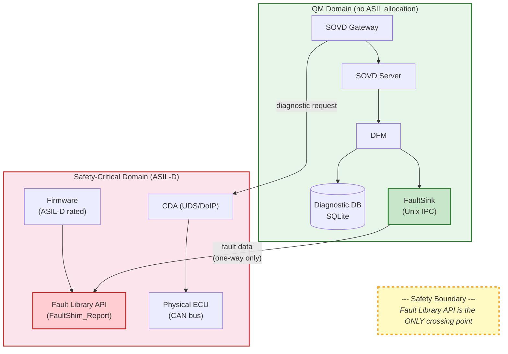
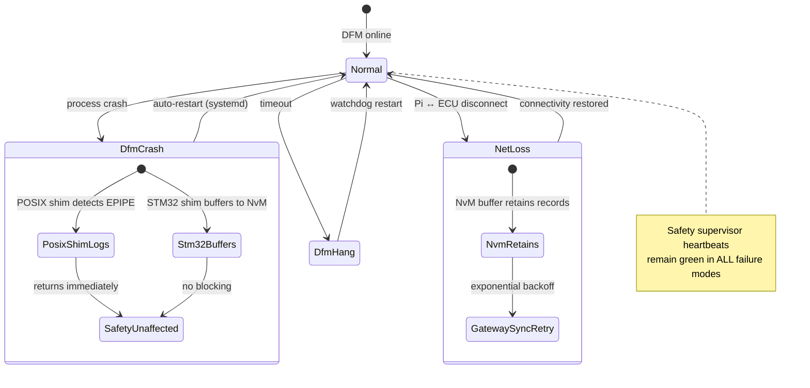

# Safety Concept

This document defines the safety architecture for taktflow-opensovd: what is
safety-relevant, what is not, and how the boundary is enforced.

## Safety classification

**OpenSOVD is QM (Quality Management).** It carries no ASIL allocation.

Safety-relevant functionality is handled by Eclipse S-CORE (up to ASIL-B) and
by the Taktflow embedded firmware (up to ASIL-D). OpenSOVD is explicitly
excluded from safety-critical execution paths.

This classification is an upstream design decision (Eclipse OpenSOVD) and is
enforced in this implementation through architectural isolation.

## Safety boundary

The Fault Library is the single interface between the QM diagnostic stack and
safety-relevant firmware. No other code path crosses the boundary.

### Boundary rules

1. **No SOVD path modifies ASIL-D firmware** without a HARA delta analysis and
   safety-engineer sign-off. This is enforced via PR review gates (SR-1.1).
2. **opensovd-core holds zero ASIL allocation.** It never links against
   ASIL-rated libraries (SR-1.2).
3. **The Fault Library API is the only crossing point.** All fault data flows
   through `FaultShim_Report` (embedded C) or the Rust `fault-lib` crate
   (POSIX). No other function call crosses the boundary.
4. **Data flows one direction for faults:** firmware -> Fault Library ->
   FaultSink IPC -> DFM -> Diagnostic DB. The DFM never writes back to
   firmware.
5. **Routine interlocks are enforced in firmware**, not in SOVD. The SOVD
   stack can request a routine execution, but the ECU firmware validates
   preconditions independently (SR-3.x).

## Fault Library -- dual implementation

The Fault Library has two implementations with identical API contracts:

| Implementation | Target | Transport | Safety |
|----------------|--------|-----------|--------|
| C shim (`FaultShim_Report`) | STM32 / TMS570 | NvM buffer, gateway sync | ASIL-D context, MISRA C:2012 clean |
| Rust crate (`fault-lib`) | POSIX / Pi | Unix domain socket to DFM | QM, `#![forbid(unsafe_code)]` |

### Embedded C shim guarantees

- **Non-blocking:** `FaultShim_Report` returns in bounded time (<10 us on
  STM32) regardless of DFM availability (SR-4.1).
- **No heap allocation:** Static buffer, fixed-size fault record.
- **NvM buffering:** Fault records are written to NvM. A gateway sync task
  flushes buffered records to the DFM when connectivity is available.
- **MISRA C:2012 compliant:** Static analysis (`cppcheck`, `coverity`) is a
  CI gate for all embedded C code (SR-2.1).

### Rust crate guarantees

- **`#![forbid(unsafe_code)]`:** The entire `fault-lib` crate is safe Rust.
  No undefined behavior is possible from this crate.
- **Bounded IPC queue:** Unix socket transport uses length-prefixed postcard
  encoding. If the DFM is unreachable, the shim logs the failure and returns
  without blocking.
- **Wire format stability:** 4-byte LE length prefix + postcard-encoded
  `FaultRecord`. The format is `no_std`-compatible for future bare-metal Rust
  targets.

## DFM failure containment

The Diagnostic Fault Manager (DFM) is QM software. Its failure must not
propagate to safety-critical systems (SR-4.2).

**Failure modes and containment:**

| Failure | Containment |
|---------|-------------|
| DFM crash | POSIX shim logs error, returns immediately. STM32 shim continues buffering to NvM. Safety supervisor heartbeats unaffected. |
| DFM hang | Bounded channel timeout. Shim does not block waiting for DFM response. |
| Network loss (Pi <-> ECU) | STM32 NvM buffer retains records. Gateway sync retries with exponential backoff when connectivity returns. |
| SQLite corruption | DFM restarts with empty database. Historical fault data is lost but live fault reporting continues. |

## DoIP transport isolation

The DoIP transport task on the ECU is isolated from safety tasks (SR-5.1):

- Runs in a separate OS task with bounded stack.
- Rate-limited: malformed DoIP frames cannot starve safety execution.
- CAN bus-off recovery is handled by the CAN driver, not by the SOVD stack.

## Routine safety interlocks

Diagnostic routines that interact with actuators enforce preconditions in
firmware, not in SOVD (SR-3.x):

| Routine | Precondition | Enforcement |
|---------|-------------|-------------|
| Motor self-test | Vehicle stationary, ignition on | ECU firmware returns NRC 0x22 (conditions not correct) if violated |
| Brake check | Explicit test-mode session active | ECU firmware validates session state |
| Flash / calibration | Engineering session + security access | UDS session and security layers in firmware |

The SOVD stack forwards the routine request. The ECU independently validates
whether execution is safe. SOVD never overrides an ECU's refusal.

## MISRA C compliance

All new embedded C code (Dcm handlers, DoIP task, Fault shim) must be
MISRA C:2012 clean. This includes:

- No dynamic memory allocation in safety-critical paths.
- No recursion.
- All switch statements have default cases.
- All functions have explicit return types.

Static analysis is enforced in CI. Violations fail the build.

## Change control for safety boundary

Any PR that touches the safety boundary requires:

1. **Explicit identification** in the PR description.
2. **Safety engineer review and sign-off.**
3. **MISRA C:2012 static analysis pass** (for embedded C changes).
4. **HARA delta analysis** if the change introduces a new code path between
   QM and ASIL-D domains.

This gate is documented in [CONTRIBUTING.md](../CONTRIBUTING.md) and enforced
through PR review policy.

## Applicable standards

| Standard | Relevance |
|----------|-----------|
| ISO 26262 | Safety lifecycle. OpenSOVD is QM; firmware is ASIL-D. |
| ISO 17978 (SOVD) | Diagnostic protocol specification. |
| ISO 14229 (UDS) | Legacy diagnostic protocol (CDA bridge). |
| MISRA C:2012 | Embedded C coding standard. |
| IEC 62443 | Cybersecurity (informative, not yet normative for this project). |
