<!--
SPDX-FileCopyrightText: 2026 The Contributors to Eclipse OpenSOVD (Taktflow fork)
SPDX-License-Identifier: Apache-2.0
-->

# Taktflow OpenSOVD -- System Specification

- Document ID: TAKTFLOW-SOVD-SPEC
- Revision: 1.0
- Status: Draft
- Date: 2026-04-16
- Owner: Taktflow SOVD workstream

> Single-document reference covering architecture, requirements, safety,
> and test strategy for the Taktflow Eclipse OpenSOVD diagnostic stack.
>
> For full detail, see the linked per-topic documents.

---

## 1. Executive Summary

Taktflow OpenSOVD is a general-purpose SOVD (ISO 17978) diagnostic stack for
**multi-ECU zonal architectures**. It replaces legacy UDS/CAN diagnostics
with modern REST/HTTP so that every ECU -- virtual or physical, regardless
of role or zone -- becomes addressable via standard HTTP tooling instead of
proprietary diagnostic hardware and binary protocols.

The HIL test bench uses a BMS zonal topology (CVC / FZC / RZC / SC) as the
reference integration, but the stack itself is architecture-agnostic within
automotive diagnostics.

| Dimension | UDS (legacy) | SOVD (this system) |
|-----------|-------------|---------------------|
| Transport | CAN + ISO-TP / DoIP | REST/HTTP over IP |
| Data format | Binary byte frames | JSON resources |
| Addressing | Session + service IDs | URL paths (`/sovd/v1/components/{id}/faults`) |
| Security | Seed/key | HTTPS + mTLS + OAuth |
| Tooling | Specialized diagnostic tools | Any HTTP client |

**Current status:** Phase 5 -- Hardware-in-the-Loop (April 2026). Full stack
running on Raspberry Pi with physical STM32 ECUs on CAN bus.

---

## 2. System Architecture

### 2.1 System context

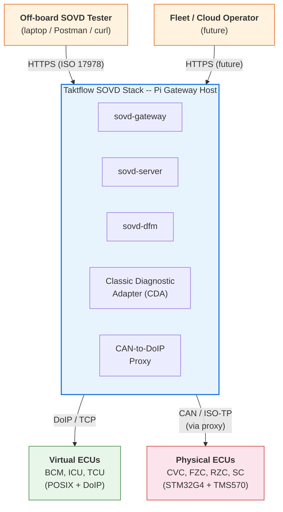

### 2.2 Component topology

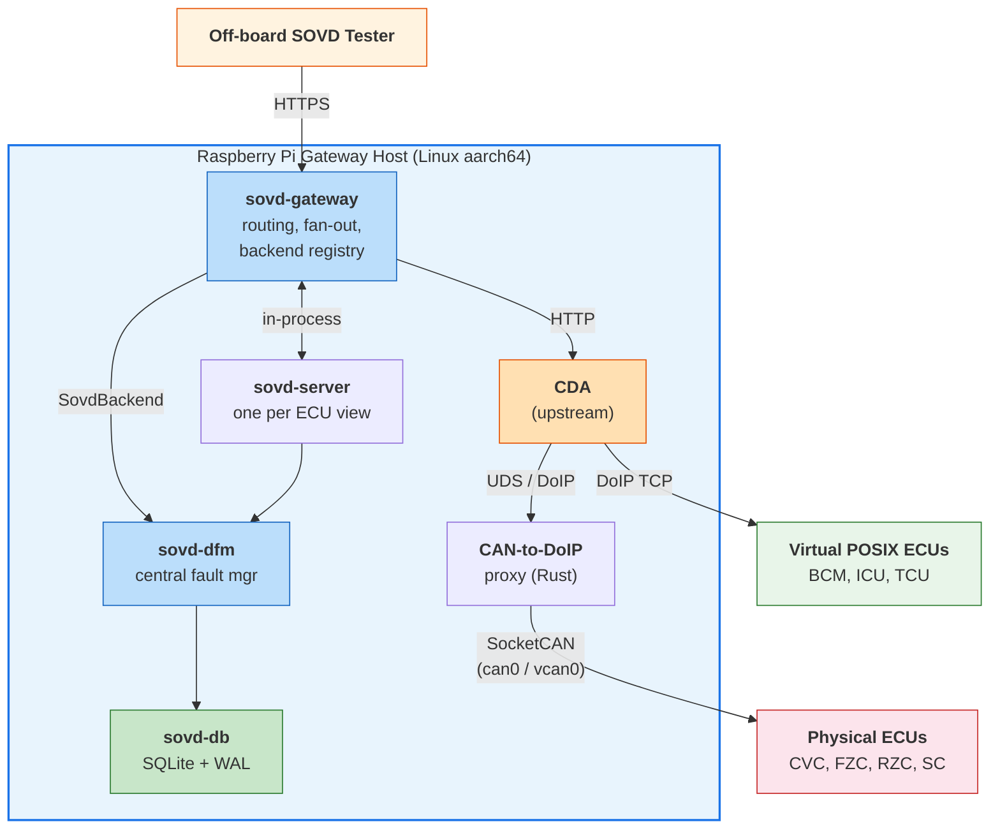

### 2.3 Crate dependency graph

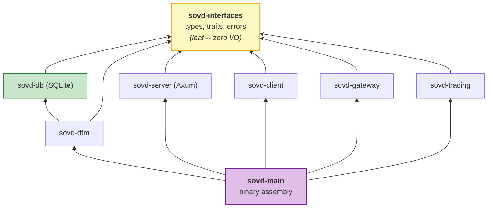

### 2.4 Protocol hops

| Hop | Protocol | Notes |
|-----|----------|-------|
| Tester -> Gateway/Server | HTTPS (ISO 17978 SOVD REST) | TLS, mTLS, JSON, correlation id |
| Gateway -> Server | in-process fn / async channel | same Tokio runtime |
| Gateway -> DFM | in-process via `SovdBackend` trait | `sovd-interfaces` |
| Gateway -> CDA | HTTP (Axum service) | in-proc or loopback |
| CDA -> ECU (virtual) | DoIP over TCP/13400 | POSIX transport |
| CDA -> Pi CAN proxy | DoIP over TCP/13400 | Pi translates |
| Pi proxy -> physical ECU | ISO-TP over CAN 500 kbps | SocketCAN |
| Fault shim -> DFM (POSIX) | Unix domain socket | postcard wire format |
| Fault shim -> DFM (STM32) | NvM buffer, gateway sync | SR-4.1 non-blocking |
| DFM -> SQLite | sqlx async driver | WAL mode |

---

## 3. Feature Matrix

### 3.1 Capability overview

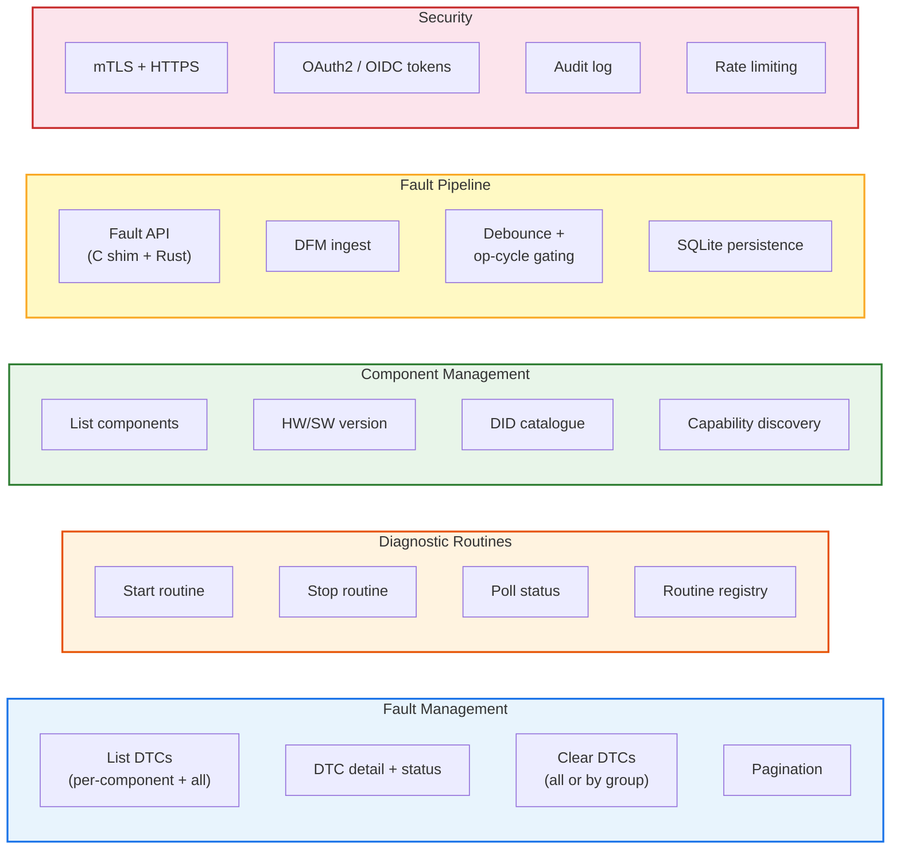

### 3.2 Feature status matrix

| Feature | Requirement | Phase | Status | Verified by |
|---------|------------|-------|--------|-------------|
| **Fault Management** | | | | |
| List DTCs per component | FR-1.1 | 4 | Done | Unit + HIL 01 |
| Per-DTC detail | FR-1.2 | 4 | Done | Unit + snapshot |
| Clear DTCs | FR-1.3 | 4 | Done | HIL 02 |
| Pagination | FR-1.4 | 4 | Done | HIL 07 |
| Multi-component aggregation | FR-1.5 | 4 | Done | Integration |
| **Diagnostic Routines** | | | | |
| Start routine | FR-2.1 | 4 | Done | HIL 03 |
| Stop routine | FR-2.2 | 4 | Done | Unit |
| Poll status | FR-2.3 | 4 | Done | HIL 03 |
| Routine registry | FR-2.4 | 4 | Done | Unit |
| **Component Metadata** | | | | |
| List components | FR-3.1 | 4 | Done | HIL 05 |
| HW/SW version | FR-3.2 | 4 | Done | HIL 05 |
| DID catalogue + read | FR-3.3 | 4 | Done | Unit |
| Capability discovery | FR-3.4 | 4 | Done | Unit |
| **Fault Pipeline** | | | | |
| Fault API (C + Rust) | FR-4.1 | 3 | Done | Integration |
| DFM ingest | FR-4.2 | 3 | Done | DFM roundtrip |
| Debounce + op-cycle | FR-4.3 | 3 | Done | Unit |
| SQLite persistence | FR-4.4 | 3 | Done | DFM roundtrip |
| Catalog version check | FR-4.5 | 3 | Done | Unit |
| **Legacy UDS** | | | | |
| Virtual ECUs over DoIP | FR-5.1 | 1-2 | Done | CDA smoke |
| Physical ECUs via proxy | FR-5.2 | 2 | Done | HIL 01-08 |
| CDA configuration | FR-5.3 | 2 | Done | Integration |
| UDS session mirroring | FR-5.4 | 2 | Done | CDA smoke |
| UDS security access | FR-5.5 | 4 | Done | Unit |
| **Gateway** | | | | |
| Routing table | FR-6.1 | 4 | Done | Integration |
| Federated hop | FR-6.2 | 6 | Stub | -- |
| **Session + Security** | | | | |
| Session resource | FR-7.1 | 4 | Done | Unit |
| Security level | FR-7.2 | 4-6 | Scaffold | -- |

---

## 4. Requirements Summary

### 4.1 Requirement traceability map

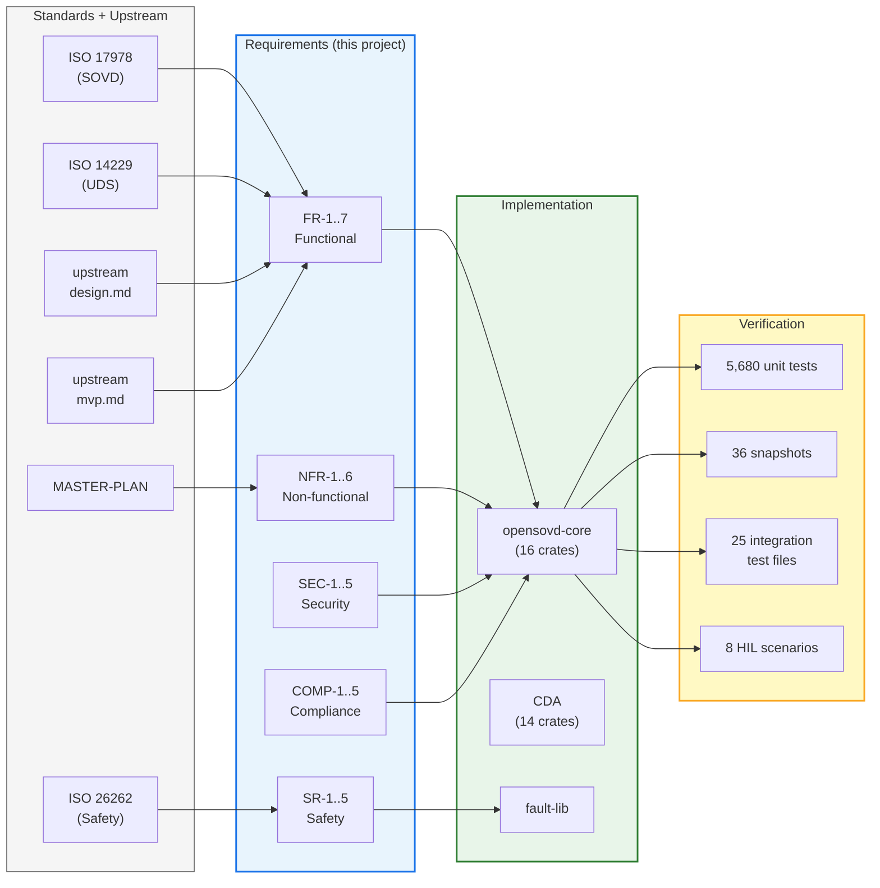

### 4.2 Non-functional requirements

| ID | Requirement | Target | Verified by |
|----|-------------|--------|-------------|
| NFR-1.1 | DTC read latency | P99 <= 500 ms (Pi, 7 ECUs) | HIL nightly |
| NFR-1.2 | Fault ingest latency | median <= 100 ms | Integration |
| NFR-1.3 | Concurrent testers | >= 2 without cross-contamination | HIL 06 |
| NFR-1.4 | Memory footprint | RSS < 200 MB (Pi steady state) | HIL nightly |
| NFR-2.1 | Degraded mode | Serve other ECUs when one fails | HIL 08 |
| NFR-2.2 | Auto-reconnect | Recovered backend reintegrated < 5 s | HIL 08 |
| NFR-2.3 | No-ECU startup | Server starts with zero backends | Integration |
| NFR-3.1 | DLT tracing | Context ids SOVD, DFM, GW, CDA | Phase 6 |
| NFR-3.2 | OpenTelemetry spans | Full request trace | Phase 6 |
| NFR-3.3 | Structured logs | JSON + correlation id | Phase 6 |
| NFR-4.1 | SIL/HIL/prod parity | Same binary, config-only diff | CI matrix |
| NFR-4.2 | Host OS portability | Linux x86_64/aarch64 + Windows | CI matrix |
| NFR-5.1 | 7-ECU MVP | Full topology concurrently | HIL 01 |
| NFR-6.1 | Upstream style parity | Indistinguishable from CDA | Phase 4 audit |

### 4.3 Safety requirements

| ID | Requirement | Enforcement |
|----|-------------|-------------|
| SR-1.1 | No SOVD path modifies ASIL-D code without HARA delta | PR gate: safety-engineer sign-off |
| SR-1.2 | opensovd-core holds zero ASIL allocation | No ASIL library linkage |
| SR-2.1 | MISRA C:2012 clean on new embedded code | cppcheck/coverity CI gate |
| SR-3.1 | Motor self-test interlock (stationary only) | ECU firmware NRC 0x22 |
| SR-3.2 | Brake check interlock (test mode only) | ECU firmware session check |
| SR-4.1 | Fault API is non-blocking | < 10 us on STM32 |
| SR-4.2 | DFM failure does not propagate to safety functions | NvM buffering on STM32 |
| SR-5.1 | DoIP transport isolation | Separate task, bounded stack, rate-limited |

### 4.4 Security requirements

| ID | Requirement | Phase |
|----|-------------|-------|
| SEC-1.1 | TLS on all external endpoints | 6 |
| SEC-2.1 | mTLS client certificate authentication | 6 |
| SEC-2.2 | OAuth2/OIDC bearer token authorization | 4 scaffold, 6 full |
| SEC-3.1 | Audit log for privileged operations | 4 |
| SEC-4.1 | Session timeout (default 30 s) | 4 |
| SEC-5.1 | Rate limiting (20 rps default) | 6 |
| SEC-5.2 | Input validation + size limits (64 KiB) | 4 |

> Full requirement details with acceptance criteria: [REQUIREMENTS.md](REQUIREMENTS.md)

---

## 5. Safety Boundary

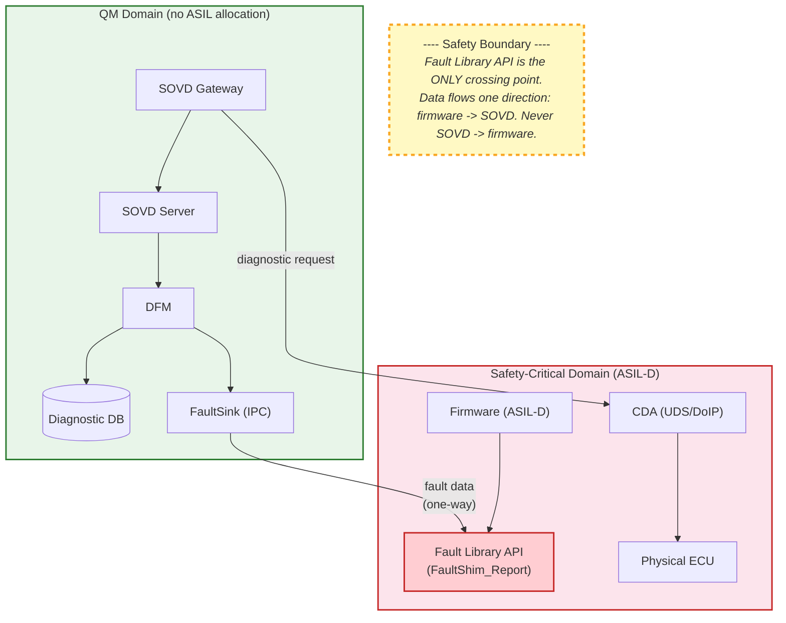

**Boundary rules:**

1. No SOVD path modifies ASIL-D firmware without HARA delta (SR-1.1)
2. opensovd-core links against zero ASIL-rated libraries (SR-1.2)
3. Fault Library API is the single crossing point
4. Fault data flows one direction: firmware -> SOVD, never reverse
5. Routine interlocks enforced in firmware, not SOVD (SR-3.x)

> Full safety concept: [SAFETY-CONCEPT.md](SAFETY-CONCEPT.md)

---

## 6. State Machines

### 6.1 DTC lifecycle

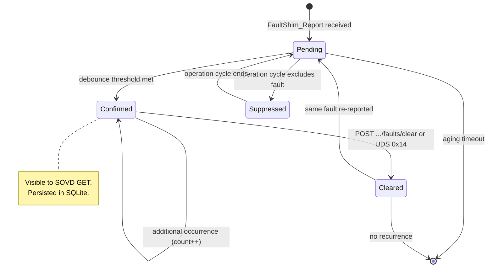

| State | Visible via SOVD | Persisted | Description |
|-------|-----------------|-----------|-------------|
| Pending | No | In-memory | Below debounce threshold |
| Confirmed | Yes | SQLite | Active DTC, reported to testers |
| Suppressed | No | In-memory | Excluded by operation cycle |
| Cleared | No | Tombstone | Cleared by tester or UDS |

### 6.2 Operation cycle

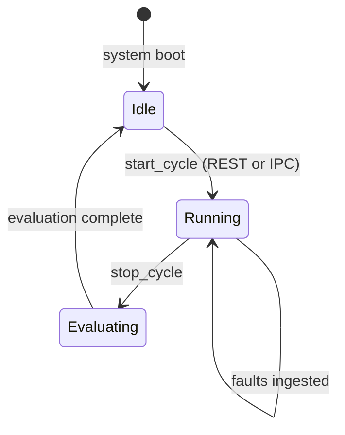

| Kind | Trigger | Description |
|------|---------|-------------|
| Ignition | ECU power events via Fault Shim IPC | Standard automotive power cycle |
| Driving | Vehicle speed > 0 via platform DID | Motion-dependent faults |
| Tester | REST POST .../operation-cycles/start | Manual diagnostic session |

---

## 7. Key Use Cases

### 7.1 UC1 -- Read DTCs (FR-1.1, FR-1.5)

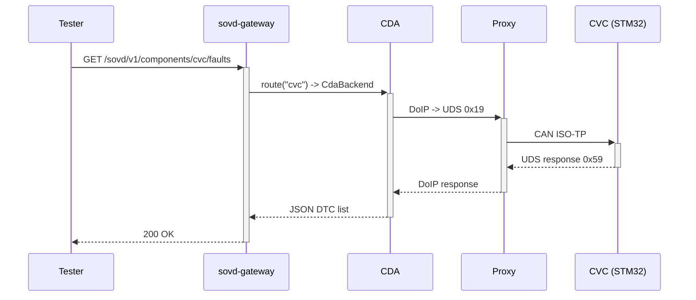

### 7.2 UC2 -- Report fault via Fault API (FR-4.1)

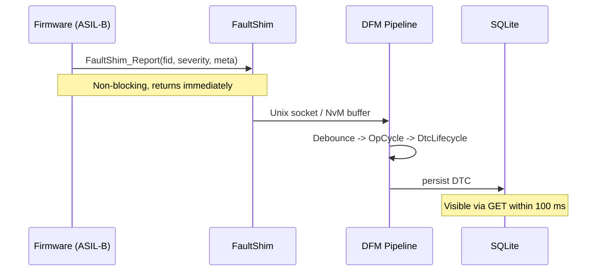

### 7.3 UC3 -- Clear DTCs (FR-1.3)

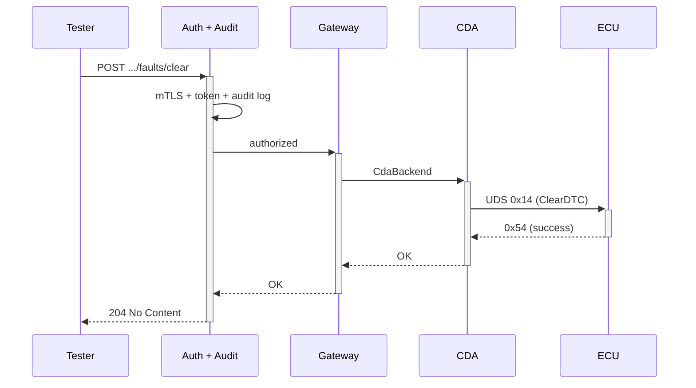

### 7.4 UC5 -- Trigger routine with safety interlock (FR-2.1, SR-3.1)

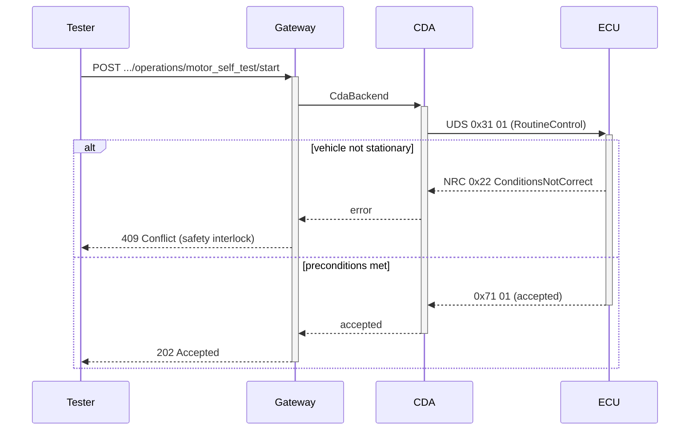

---

## 8. API Surface

### 8.1 REST endpoints (ISO 17978)

| Method | Endpoint | Description | Req |
|--------|----------|-------------|-----|
| GET | `/sovd/v1/components` | List all components | FR-3.1 |
| GET | `/sovd/v1/components/{id}` | Component detail (HW/SW version) | FR-3.2 |
| GET | `/sovd/v1/components/{id}/faults` | List DTCs (with status-mask, pagination) | FR-1.1 |
| GET | `/sovd/v1/components/{id}/faults/{dtc}` | Single DTC detail | FR-1.2 |
| POST | `/sovd/v1/components/{id}/faults/clear` | Clear DTCs | FR-1.3 |
| GET | `/sovd/v1/faults` | Aggregated DTCs across all components | FR-1.5 |
| GET | `/sovd/v1/components/{id}/operations` | Routine catalogue | FR-2.4 |
| POST | `/sovd/v1/components/{id}/operations/{rid}/start` | Start routine | FR-2.1 |
| POST | `/sovd/v1/components/{id}/operations/{rid}/stop` | Stop routine | FR-2.2 |
| GET | `/sovd/v1/components/{id}/operations/{rid}/status` | Poll routine status | FR-2.3 |
| GET | `/sovd/v1/components/{id}/data` | List DIDs | FR-3.3 |
| GET | `/sovd/v1/components/{id}/data/{did}` | Read single DID | FR-3.3 |
| POST | `/sovd/v1/sessions` | Create session | FR-7.1 |
| GET | `/sovd/v1/health` | Liveness check | -- |

### 8.2 Middleware stack

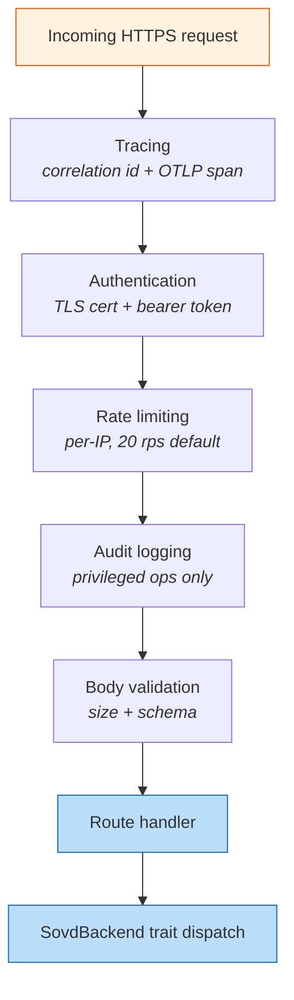

### 8.3 OpenAPI contract

The API schema is snapshot-locked to ASAM SOVD v1.1. Any schema change is
detected by `cargo xtask openapi-dump --check` and fails CI.

- 36 golden JSON snapshot files verify wire format stability
- Schema regeneration is a PR gate

---

## 9. Deployment Topologies

### 9.1 Topology comparison

| Aspect | SIL (Docker Compose) | HIL (Pi bench) | Production |
|--------|---------------------|----------------|------------|
| Host | Linux x86_64 | Raspberry Pi aarch64 | Pi aarch64 |
| ECUs | POSIX containers (DoIP) | Physical STM32 + virtual | Physical + virtual |
| CAN bus | vcan0 (virtual) | can0 (500 kbps real) | can0 (real) |
| TLS | Optional (localhost) | Optional | mTLS enforced |
| DLT | Local viewer | Local viewer | Cloud collector |
| Binary | Same artifact | Same artifact | Same artifact |

### 9.2 HIL test bench

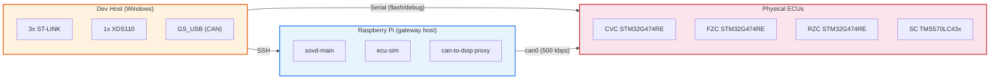

---

## 10. Test Strategy

### 10.1 Test pyramid

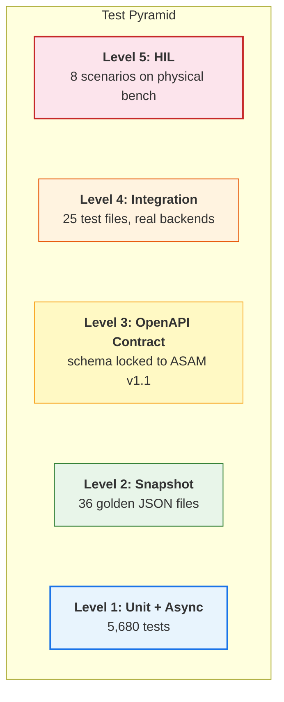

### 10.2 HIL scenario matrix

| # | Scenario | Validates |
|---|----------|-----------|
| 01 | Read faults (all ECUs) | Full fault read path, P99 latency |
| 02 | Clear faults | DTC clear SOVD -> UDS -> CAN |
| 03 | Operation execution | Routine trigger + status polling |
| 04 | CAN bus-off | Fault detection and recovery |
| 05 | Components metadata | ECU HW/SW versions via SOVD |
| 06 | Concurrent testers | Multi-client concurrent access |
| 07 | Large fault list | Pagination under high fault count |
| 08 | Error handling | Invalid requests, timeouts, error codes |

### 10.3 CI pipeline

| Gate | Command | Enforcement |
|------|---------|-------------|
| Format | `cargo +nightly fmt -- --check` | Hard fail |
| Clippy | `cargo clippy --all-targets -- -D warnings` | Hard fail |
| License | `cargo deny check` | Hard fail |
| Unit + integration tests | `cargo test --locked` | Hard fail |
| OpenAPI | `cargo xtask openapi-dump --check` | Hard fail |
| Feature matrix | `--all-features`, `--no-default-features`, `--features mbedtls` | Hard fail |
| Platforms | Linux x86_64, Windows x86_64 | Hard fail |

---

## 11. Component Catalogue

### 11.1 opensovd-core workspace (16 crates)

| Crate | Purpose | Req |
|-------|---------|-----|
| `sovd-interfaces` | Trait + type contracts. Zero I/O. | All FR |
| `sovd-server` | Axum HTTP server, OpenAPI via utoipa | FR-1.x, FR-2.x, FR-3.x |
| `sovd-gateway` | Federated routing, parallel fan-out | FR-1.5, FR-6.x |
| `sovd-dfm` | Diagnostic Fault Manager | FR-4.x |
| `sovd-db-sqlite` | SQLite persistence, WAL, migrations | FR-4.4 |
| `sovd-db-score` | S-CORE KV backend (placeholder) | -- |
| `fault-sink-unix` | Unix socket IPC, postcard wire format | FR-4.1, FR-4.2 |
| `fault-sink-lola` | S-CORE LoLa shared-memory (placeholder) | -- |
| `opcycle-taktflow` | In-process operation cycle state machine | FR-4.3 |
| `opcycle-score-lifecycle` | S-CORE lifecycle subscriber (placeholder) | -- |
| `sovd-tracing` | DLT + OTLP subscriber configuration | NFR-3.x |
| `sovd-main` | Binary entry point, TOML config loader | -- |
| `sovd-client` | HTTP client (skeleton) | FR-6.2 |
| `xtask` | `cargo xtask openapi-dump [--check]` | COMP-1.1 |
| `integration-tests` | End-to-end test suite | All |

### 11.2 Supporting components

| Component | Language | Lines | Purpose |
|-----------|----------|-------|---------|
| `classic-diagnostic-adapter/` | Rust | ~68k | SOVD-to-UDS/DoIP bridge (upstream fork, 14 crates) |
| `fault-lib/` | Rust | ~600 | Framework-agnostic fault API, `#![forbid(unsafe_code)]` |
| `dlt-tracing-lib/` | Rust | ~1.9k | Rust tracing subscriber for COVESA DLT |
| `odx-converter/` | Kotlin | ~4.2k | ODX (.pdx) to MDD binary format converter |

---

## 12. Design Principles

1. **Rust-first.** Async (Tokio), memory-safe, `#![forbid(unsafe_code)]` where
   possible. Clippy pedantic + deny enforced in CI.
2. **Trait boundaries, not frameworks.** `sovd-interfaces` defines all contracts
   with zero I/O. Implementations are swappable.
3. **Spec-locked API surface.** OpenAPI schema snapshot-tested against ASAM SOVD v1.1.
4. **Build first, contribute later.** No upstream PRs during early phases.
5. **Extras on top, never inside mirrored code.** Taktflow customizations live
   in layered crates, not inline edits to upstream files.
6. **Isolation over integration on the safety axis.** Fault Library is the ONLY
   boundary between QM and ASIL-D.

---

## 13. Standards Compliance

| Standard | Relevance |
|----------|-----------|
| ISO 17978 (SOVD) | Primary API specification. MVP subset conformance. |
| ISO 14229 (UDS) | Legacy diagnostic protocol via CDA bridge. |
| ISO 26262 | Safety lifecycle. OpenSOVD is QM; firmware is ASIL-D. |
| ISO 13400 (DoIP) | Diagnostic transport over IP. |
| ISO 15765-2 (ISO-TP) | CAN transport protocol. |
| MISRA C:2012 | Embedded C coding standard for safety-critical code. |
| ASAM MCD-2D (ODX) | Diagnostic data exchange format. |
| Automotive SPICE | Process assessment; L2-3 traceability required. |
| Apache-2.0 | License. REUSE/SPDX compliance enforced. |

---

## 14. Related Documents

| Document | Description |
|----------|-------------|
| [ARCHITECTURE.md](ARCHITECTURE.md) | Full arc42 architecture with detailed views |
| [REQUIREMENTS.md](REQUIREMENTS.md) | Complete FR/NFR/SR/SEC/COMP with acceptance criteria |
| [SAFETY-CONCEPT.md](SAFETY-CONCEPT.md) | Safety boundary, failure containment, MISRA |
| [TEST-STRATEGY.md](TEST-STRATEGY.md) | Test levels, CI pipeline, coverage |
| [TRADE-STUDIES.md](TRADE-STUDIES.md) | 18 trade studies for every major decision |
| [DEPLOYMENT-GUIDE.md](DEPLOYMENT-GUIDE.md) | SIL/HIL/production deployment |
| [DEVELOPER-GUIDE.md](DEVELOPER-GUIDE.md) | Build, run, and test instructions |
| [GLOSSARY.md](GLOSSARY.md) | Domain terminology |
| [docs/adr/](adr/) | 18 Architecture Decision Records |

---

## 15. Revision History

| Rev | Date | Author | Change |
|-----|------|--------|--------|
| 1.0 | 2026-04-16 | SOVD workstream | Initial consolidated specification |
