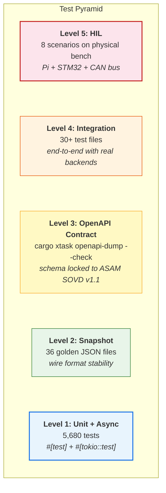
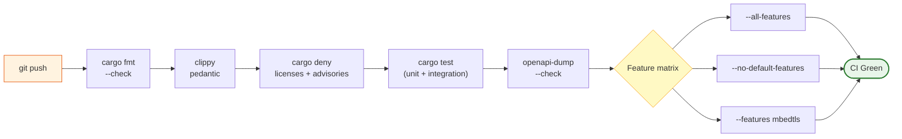

# Test Strategy

This document defines the testing approach for taktflow-opensovd: what is
tested, how, at which level, and what gates a merge.

## Test pyramid



## CI pipeline overview



## Test levels

### Level 1: Unit tests

**Scope:** Individual functions, types, and trait implementations in isolation.

**Framework:** `#[test]` and `#[tokio::test]` (async).

**Count:** 5,680 tests across all Rust crates.

**Execution:**
```bash
cargo test --locked -- --show-output
```

**Standards:**
- Every public function with non-trivial logic must have unit tests.
- `.unwrap()` is permitted in test code (`allow-unwrap-in-tests = true`).
- Tests must not depend on network, filesystem state, or timing. Use
  `tempfile` for ephemeral storage.

### Level 2: Snapshot tests

**Scope:** OpenAPI schema stability against ASAM SOVD v1.1.

**Location:** `opensovd-core/sovd-interfaces/tests/snapshots/` (36 golden
JSON files).

**Mechanism:** `utoipa::PartialSchema` is serialized to JSON and compared
against checked-in snapshots. Any drift causes test failure.

**Regeneration:**
```bash
UPDATE_SNAPSHOTS=1 cargo test -p sovd-interfaces
```

**Purpose:** Prevents accidental schema drift. The SOVD REST API surface is
locked to the ASAM spec. Any change to the wire format must be deliberate
and reviewed.

### Level 3: OpenAPI contract gate

**Scope:** Full OpenAPI YAML document generated from the live server.

**Mechanism:** `cargo xtask openapi-dump --check` regenerates the OpenAPI
spec from `utoipa::OpenApi` and diffs against the checked-in
`sovd-server/openapi.yaml`.

**Gate:** Runs on every PR. Staleness fails CI.

**Regeneration:**
```bash
cargo xtask openapi-dump
```

### Level 4: Integration tests

**Scope:** End-to-end flows through real trait implementations.

**Location:** `opensovd-core/integration-tests/tests/` (30+ test files).

**Phases:**
| Test file pattern | What it validates |
|-------------------|-------------------|
| `in_memory_mvp_flow` | Full SOVD REST API against InMemoryServer |
| `phase2_cda_ecusim_*` | CDA + ECU simulator smoke and data mode tests |
| `phase3_dfm_sqlite_roundtrip` | DFM fault ingest -> SQLite -> REST query |
| `phase4_openapi_staleness` | OpenAPI spec matches live server |
| `phase4_sovd_real_backends` | Live CDA + SQLite DFM backend |
| `phase4_sovd_gateway_*` | Gateway routing with real backends |
| `phase5_hil_sovd_*` | HIL tests against physical bench |
| `phase11_conformance_iso_17978` | ADR-0039 subset gate for standard SOVD routes, including bulk-data |
| `phase11_conformance_iso_20078` | ADR-0027 partial Extended Vehicle conformance boundary |
| `phase11_conformance_interop` | Standard-vs-extra boundary, header compatibility, fail-closed behavior |

**Execution:**
```bash
cargo test --locked --features integration-tests -- --show-output
```

**Characteristics:**
- Tests use `reqwest` HTTP client against real Axum routers.
- No handmade mocks. All tests hit real trait implementations.
- `tempfile` databases for SQLite tests (no cleanup needed).
- Phase 5 tests are gated (see Level 5).

### Level 5: Hardware-in-the-Loop (HIL)

**Scope:** Full stack on physical hardware -- SOVD server on Pi, CDA, DoIP
proxy, physical STM32 ECUs on CAN bus.

**Gating:** Tests check `TAKTFLOW_BENCH=1` environment variable. Without it,
tests skip cleanly with a log message (no failure, no `#[ignore]`).

**Preflight probes:**
- TCP connectivity to Pi ECU simulator (DoIP endpoint).
- TCP connectivity to local CDA instance.
- SSH access to Pi for service lifecycle control.

**BenchGuard pattern:** RAII struct manages SSH lifecycle -- starts/stops
ECU simulator and proxy via `systemctl` over SSH. Cleanup is guaranteed
even on test panic.

**HIL test suite:**
| Test | Validates |
|------|-----------|
| `phase5_hil_sovd_01_read_faults_all` | Full fault read path through physical ECU |
| `phase5_hil_sovd_02_clear_faults` | DTC clear command through SOVD -> UDS -> CAN |
| `phase5_hil_sovd_03_operation_execution` | Routine trigger and status polling |
| `phase5_hil_sovd_04_can_busoff` | CAN bus-off fault detection and recovery |
| `phase5_hil_sovd_05_components_metadata` | ECU metadata (HW/SW versions) via SOVD |
| `phase5_hil_sovd_06_concurrent_testers` | Multiple SOVD clients concurrent access |
| `phase5_hil_sovd_07_large_fault_list` | Pagination under high fault count |
| `phase5_hil_sovd_08_error_handling` | Invalid requests, timeouts, error codes |

**Capture logs:** Raw CAN frame captures are stored in
`docs/phase-2-hil-capture/` for post-mortem analysis.

**Execution:**
```bash
TAKTFLOW_BENCH=1 cargo test --locked --features integration-tests -- --show-output
```

## CI pipeline

### Every push

| Check | Command | Gate |
|-------|---------|------|
| Format | `cargo +nightly fmt -- --check` | Hard fail |
| Clippy (stable) | `cargo clippy --all-targets --all-features -- -D warnings` | Hard fail |
| Clippy (nightly) | `cargo +nightly clippy --all-targets --all-features` | Warn only |
| License audit | `cargo deny check licenses advisories sources bans` | Hard fail |
| Unit tests | `cargo test --locked -- --show-output` | Hard fail |
| Integration tests | `cargo test --locked --features integration-tests -- --show-output` | Hard fail |
| OpenAPI gate | `cargo xtask openapi-dump --check` | Hard fail |
| Phase 11 conformance | `.github/workflows/phase11-conformance.yml` | Hard fail |

### Feature matrix

CI tests against multiple feature configurations:

| Configuration | Purpose |
|---------------|---------|
| `--all-features` | Full build with everything enabled |
| `--no-default-features` | Minimal build (catches accidental feature coupling) |
| `--features mbedtls` (CDA) | mbedtls-only TLS backend |
| Default | Standard feature set |

### Platform matrix

| Platform | Status |
|----------|--------|
| Linux (ubuntu-latest) | CI |
| Windows | CI |
| macOS | Manual |
| aarch64 (Pi) | HIL bench only |

## Coverage

**Tooling:** `cargo-llvm-cov` generates LCOV and JSON coverage reports.

**Reporting:** Coverage percentage is reported per CI run. No minimum threshold
is currently enforced, but coverage trends are monitored.

**Exclusions:** Test code, generated code, and platform-specific stubs are
excluded from coverage metrics.

## Test data and fixtures

- **InMemoryServer:** Provides canned fault, operation, and component data for
  unit and integration tests. No external dependencies.
- **ECU simulator:** POSIX builds of CVC/FZC/RZC firmware run on the Pi or in
  Docker, providing real DoIP endpoints.
- **Scenario YAML:** Phase 5 concurrent tester tests load component lists and
  tester profiles from YAML configuration files.
- **Snapshot JSON:** 36 golden files lock the SOVD schema wire format.

## Docker test infrastructure

- `opensovd-core/testcontainer/`: Dockerfiles for CDA, ECU simulator, ODX database.
- `classic-diagnostic-adapter/testcontainer/docker-compose.yml`: Local SIL
  orchestration.
- SIL tests can run entirely in Docker without physical hardware.
