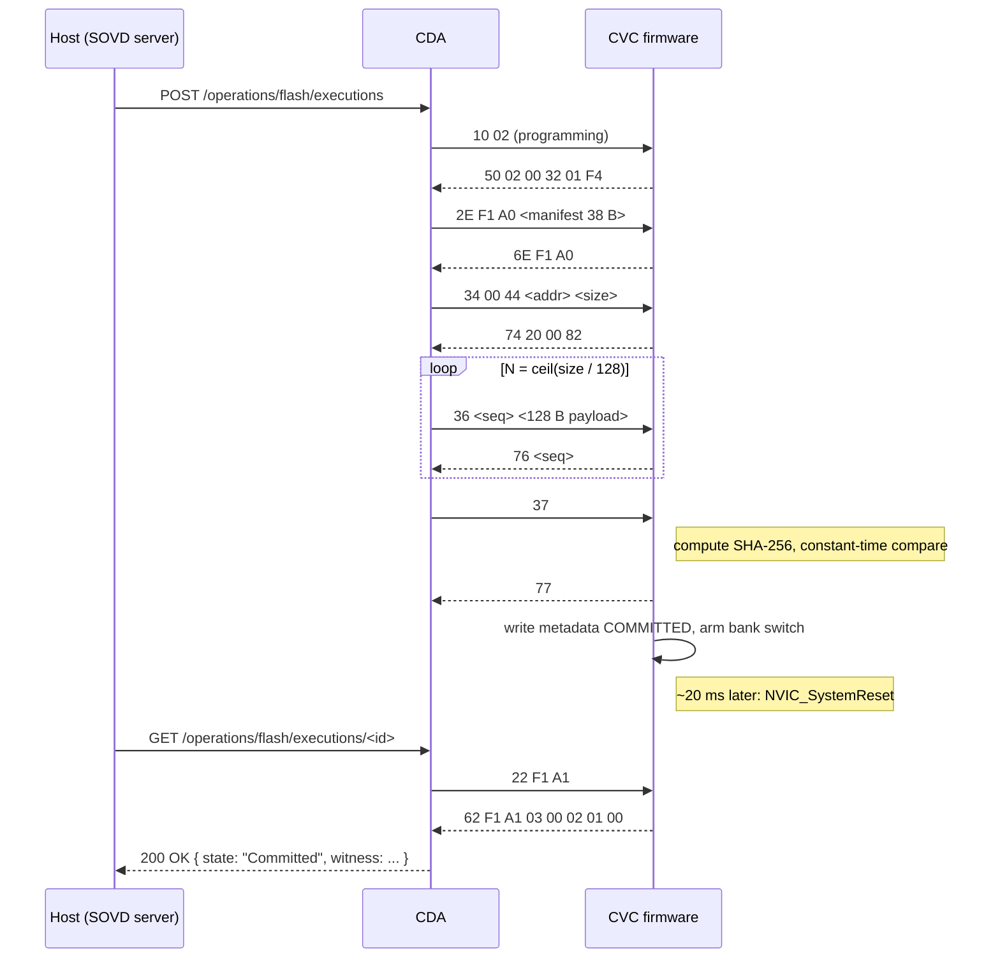
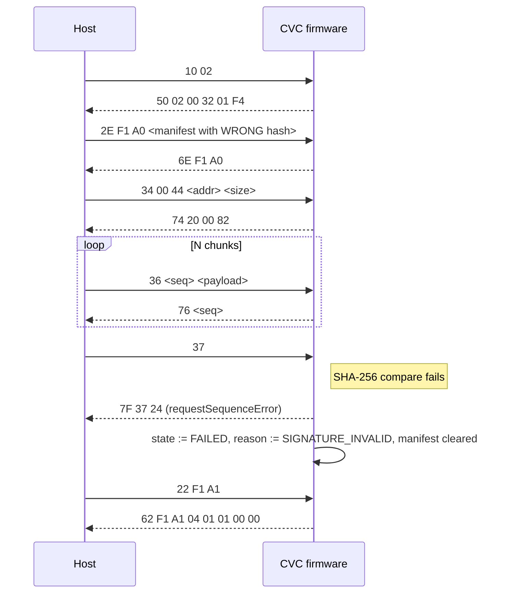
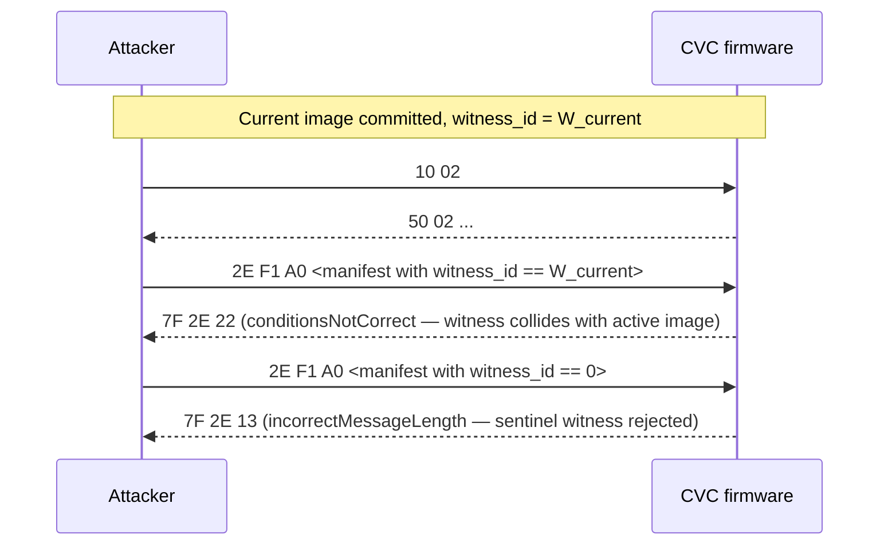
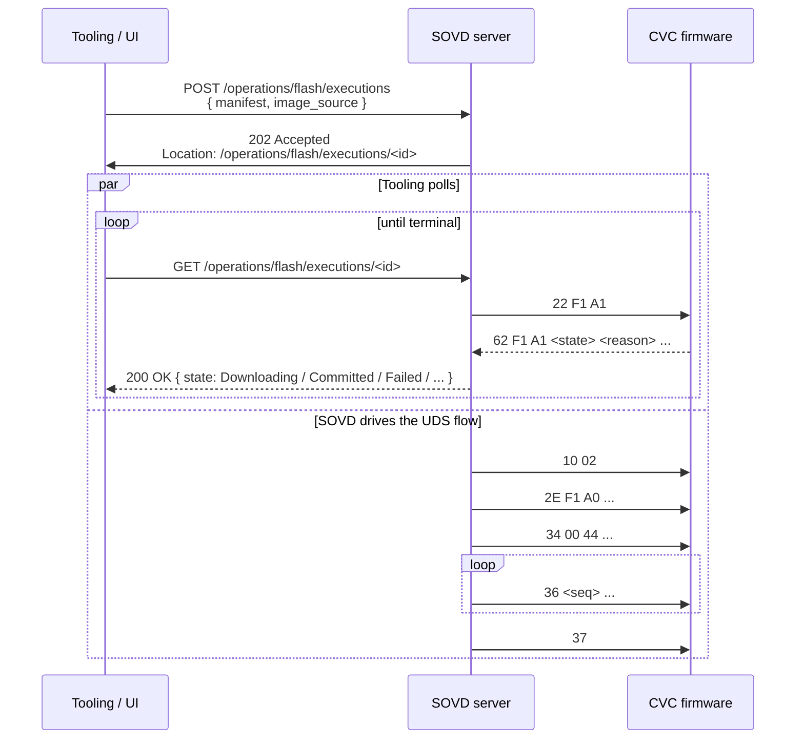

# CVC OTA — Sequence Diagrams

Mermaid diagrams for each supported flow. GitHub renders these inline;
for other viewers, a plain-text description follows each diagram.

## 1. Happy path — full flash + commit



**Narrative.** The host opens a programming session, writes the
manifest, starts download, loops TransferData chunks, finalizes with
RequestTransferExit, and polls the status DID until state reports
`Committed`. The ECU bank-switches ~20 ms after committing; the next
boot lands on the new image.

## 2. Happy path — rollback after commit

```mermaid
sequenceDiagram
    participant H as Host
    participant E as CVC firmware

    Note over H,E: Previous flow committed COMMITTED; host decides to roll back
    H->>E: 22 F1 A2
    E-->>H: 62 F1 A2 <witness_id>
    H->>E: 31 01 02 02
    Note right of E: write metadata ROLLEDBACK, arm reverse bank switch
    E-->>H: 71 01 02 02 05
    Note right of E: ~20 ms later: NVIC_SystemReset
    H->>E: 22 F1 A1
    E-->>H: 62 F1 A1 05 00 01 01 00
```

**Narrative.** After a commit, the host captures the new witness, then
issues the rollback routine. The ECU writes the "other" bank's metadata
(the previously-active bank, which will become active again after
reset) with state `ROLLEDBACK`, arms the bank-switch reversal, and
resets. On next boot the previously-active image runs again.

## 3. Failure — hash mismatch



**Narrative.** Host delivers the full image but the manifest's
`expected_sha256` does not match what the ECU hashes on the inactive
bank. The `0x37` response is negative with NRC `0x24` and the status
DID reports `FAILED / SIGNATURE_INVALID`. The manifest is cleared; the
host must re-author + re-write to retry.

## 4. Failure — inactivity timeout

```mermaid
sequenceDiagram
    participant H as Host
    participant E as CVC firmware

    H->>E: 10 02
    E-->>H: 50 02 ...
    H->>E: 2E F1 A0 <manifest>
    E-->>H: 6E F1 A0
    H->>E: 34 00 44 <addr> <size>
    E-->>H: 74 20 00 82
    H->>E: 36 01 <payload>
    E-->>H: 76 01
    Note right of E: host disappears; no further 0x36
    Note right of E: 10 s elapses
    Note right of E: ota_poll transitions state := FAILED, reason := TIMEOUT, manifest cleared
    H->>E: 36 02 <payload>
    E-->>H: 7F 36 24   (requestSequenceError, state is no longer DOWNLOADING)
    H->>E: 22 F1 A1
    E-->>H: 62 F1 A1 04 06 01 00 00
```

**Narrative.** The host sends the first chunk then pauses. After 10 s
without a fresh `0x36`, the firmware transitions to `FAILED / TIMEOUT`
in `ota_poll`. The next `0x36` is rejected because state is no longer
`DOWNLOADING`. The host observes this either through the negative
response or by polling `F1A1`.

## 5. Failure — mid-transfer manifest swap attempt

```mermaid
sequenceDiagram
    participant A as Attacker
    participant E as CVC firmware

    A->>E: 10 02
    E-->>A: 50 02 ...
    A->>E: 2E F1 A0 <manifest M1, hash H1>
    E-->>A: 6E F1 A0
    A->>E: 34 00 44 <addr> <size>
    E-->>A: 74 20 00 82
    A->>E: 36 01 <partial image bytes>
    E-->>A: 76 01
    Note over A,E: Attacker tries to swap the manifest mid-transfer to mask substituted payload
    A->>E: 2E F1 A0 <manifest M2, hash H2>
    E-->>A: 7F 2E 22    (conditionsNotCorrect — manifest locked)
    Note right of E: state is DOWNLOADING; manifest is locked until IDLE / FAILED / COMMITTED
```

**Narrative.** The manifest-lock check in `ota_write_did` rejects the
swap attempt with NRC `0x22` (conditionsNotCorrect). The attacker
cannot change the expected hash while bytes are in flight.

## 6. Failure — no manifest before transfer

```mermaid
sequenceDiagram
    participant A as Attacker
    participant E as CVC firmware

    A->>E: 10 02
    E-->>A: 50 02 ...
    A->>E: 34 00 44 <addr> <size>
    E-->>A: 7F 34 22   (conditionsNotCorrect — NO_MANIFEST)
    Note over A,E: Attacker cannot skip the manifest step; RequestDownload is gated on manifest_ready
```

**Narrative.** Without writing DID `0xF1A0` first, `0x34` is rejected.
This closes the self-certification hole where pre-hardening firmware
would accept any image and invent its own expected hash.

## 7. Failure — witness replay attempt



**Narrative.** The witness-replay guard rejects both the collision-
with-active-image case and the sentinel-zero case.

## 8. Host-side async envelope (SOVD REST layer)



**Narrative.** Per ADR-0034 (async-first diagnostic runtime), the SOVD
REST surface returns `202 Accepted` immediately and the tooling polls
the status URL until a terminal state is reached. The SOVD server
internally drives the UDS state machine in parallel with the polling
stream. The two flows share the host-side `bulk_transfers` state
record.
